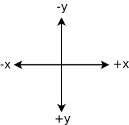

**Due**: Wednesday, September 23rd by 11:59 PM

Getting Started
===============

Download [CS201\_Assign02.zip](CS201_Assign02.zip) and import it into your Eclipse workspace (**File&rarr;Import&rarr;General&rarr;Existing projects into workspace&rarr;Archive file**.)

You should see a project called **CS201\_Assign02** in the Package Explorer.

Your Task
=========

You have two tasks:

-   Complete the implementation of the **Point**, **Circle** and **Rectangle** classes.
-   Improve the JUnit tests for each of the above classes.

Implementing Point, Circle, and Rectangle
-----------------------------------------

The **Point**, **Circle**, and **Rectangle** classes represent points and shapes in the x/y coordinate plane.

**Important**: in these classes, y values increase in the *down* direction, and decrease in the *up* direction:

> 

Each of the three classes is partially specified. Each class has a number of methods, but each method has a body containing the statement

    throw new UnsupportedOperationException("TODO - implement");

which indicates that the method has not been implemented. You will need to replace each such statement with an actual method body that carries out the behavior described by the method's documentation comment.

In addition, none of the classes defines any fields. You will need to add fields as necessary to store the data that is needed by each object. For example, the **Point** class will need fields to store the values of the x and y coordinates.

Improving the JUnit tests
-------------------------

In the **junit** source directory are three JUnit test classes, **PointTest**, **CircleTest**, and **RectangleTest**. The **PointTest** class is fairly complete. The **CircleTest** and **RectangleTest** classes are somewhat incomplete.

You will need to add test fixture objects and test methods to **CircleTest** and **RectangleTest** so that they are more complete.

One measure of the completeness of a test class is that each method in the class being tested should be tested at least once. For example, the **PointTest** class satisfies this measure of completeness. The **Point** class has four methods (a constructor, **getX**, **getY**, and **distanceTo**), and the **PointTest** class tests all of them.

Hints
=====

The geometric distance between two points is

> sqrt((x2 - x1) \* (x2 - x1) + (y2 - y1) \* (y2 - y1))

where (x1,y1) and (x2,y2) are the coordinates of the points.

You can use the **Math.sqrt** method to compute the square root of a **double** value.

You will need to think carefully about how to implement the **overlaps** method in the **Rectangle** class.  Here is a sketch of a possible approach:

* If the center of the circle is inside the rectangle, then there is definitely overlap.
* If the center of the circle is directly above, below, to the left, or to the right of the rectangle, and the distance between the center of the circle and the closest edge is less than the radius of the circle, then there is overlap.
* If the center of the circle is in one of the corner regions, and the distance from the center of the circle to the closest corner of the rectangle is less than the radius of the circle, then there is overlap.
* Otherwise, there is no overlap.

When you write tests, you may need to test whether a **Point** object has expected x and y coordinate values.  There are two ways you can do this:

* Add an **equals** method to the **Point** class (see [Lecture 9](../lectures/lecture09.html))
* Use separate assertions for the x and y coordinates.  For example, to check the coordinates of the center of a **Circle** object:

     ```java
     Point center = someCircle.getCenter();
     assertEquals(5.0, center.getX(), DELTA);
     assertEquals(6.0, center.getY(), DELTA);
     ```


Grading
=======

Your grade will be determined as follows:

-   **Point** class: 20%
-   **Circle** class: 20%
-   **Rectangle** class: 20%
-   **CircleTest** test class: 20%
-   **RectangleTest** test class: 20%

I expect that you will use good coding style (comments, consistent indentation, meaningful names for variables and methods.) I may deduct points for poor coding style.

Submitting
==========

When you are done, submit the lab to the Marmoset server using either of the methods below.

> **Important**: after you submit, log into the submission server and verify that the correct files were uploaded. You are responsible for ensuring that you upload the correct files. I may assign a grade of 0 for an incorrectly submitted assignment.

From Eclipse
------------

If you have the [Simple Marmoset Uploader Plugin](../resources/index.html) installed, select the project (**CS201\_Assign02**) in the package explorer and then press the blue up arrow button in the toolbar. Enter your Marmoset username and password when prompted.

From a web browser
------------------

Save the project (**CS201\_Assign02**) to a zip file by right-clicking it and choosing

> **Export...&rarr;Archive File**

Upload the saved zip file to the Marmoset server as **assign02**. The server URL is

> [https://cs.ycp.edu/marmoset/](https://cs.ycp.edu/marmoset/)
