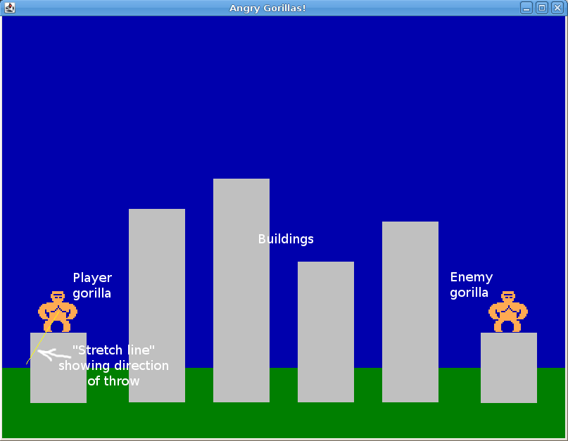
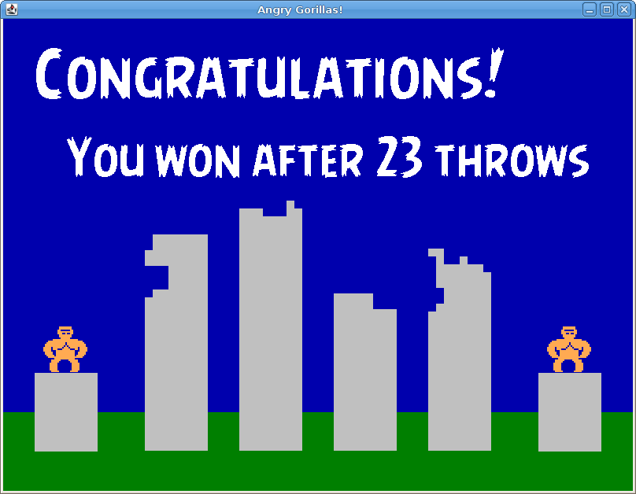

**Milestone 1 due**: Friday, Oct 2nd by 11:59 PM

**Milestone 2 due**: Tuesday, Oct 13th by 11:59 PM

Getting Started
===============

Download [CS201\_Assign03.zip](CS201_Assign03.zip) and import it into your Eclipse workspace (**File&rarr;Import&rarr;General&rarr;Existing projects into workspace&rarr;Archive file**.)

You should see a project called **CS201\_Assign03** in the Package Explorer.

You should copy the **Point**, **Circle**, and **Rectangle** classes from your **CS201\_Assign02** project into the **edu.ycp.cs201.gorilla** package, since you will use them in this assignment.

To run the program, right-click on **AngryGorillasView** and choose **Run As&rarr;Java Application**.

> 
This is a substantial assignment. Do not wait until the last minute to start it!

Angry Gorillas!
===============

In this assignment, you will implement a game based on the classic [QBasic](http://en.wikipedia.org/wiki/QBasic) game [gorilla.bas](http://en.wikipedia.org/wiki/Gorillas_(video_game\)), included in MS-DOS 5.0 in 1990.

In your implementation of the game, the player controls a gorilla who tries to throw explosive bananas at an enemy gorilla. There are several buildings in the way, making hitting the enemy gorilla more challenging. The player controls the trajectory of the banana by clicking and then dragging the mouse pointer: the direction and velocity of the banana are based on the points where the original mouse click and the release occur. The gameplay may remind you of [similar game that has enjoyed some popularity in recent years](http://www.angrybirds.com/).

You can download our implementation of the game here:

> [angryGorillas-obfuscated.jar](angryGorillas-obfuscated.jar)

On Windows or Mac OS, you should be able to run the program by double-clicking on the jar file. You can also run it from the command line using the command

    java -jar angryGorillas-obfuscated.jar

Here is an annotated screenshot showing the basic gameplay elements (click for full size):

> 

Each time the player launches a banana, it will either hit a building (damaging it) or hit the enemy gorilla. When the player hits the gorilla, ending the game, a final screen showing the number of throws is displayed:

> 

Model, View, Controller
=======================

You will use a model/view/controller architecture. There are three important classes:

-   **AngryGorillasModel**: The class keeps track of all of the data, such as the positions of the gorillas, the current position/direction/velocity of the banana, locations and sizes of buildings, etc. Also keeps track of the "state", e.g., whether the user is dragging the mouse, whether the user has released the mouse and the banana is in-flight, etc.
-   **AngryGorillasController**: This class has methods that perform the important operations on the data in the model. For example, updating information about the mouse drag, calculating the initial position/direction/velocity of the banana when it is thrown, checking whether the banana has hit a building or the enemy gorilla, etc.
-   **AngryGorillasView**: This class is the GUI. It handles user input events (calling controller methods to update the model). It also handles paint events, drawing a visual rendering of the data in the model.

A skeletal implementation of each of these classes is provided.

In addition to these three classes, you will use the **Point**, **Circle**, and **Rectangle** classes from [Assignment 2](assign02.html). Make sure they are copied into the **edu.ycp.cs201.gorilla** package.

Milestone 1
===========

In milestone, your goals are:

-   Have the controller create initial model data, including the locations/sizes of buildings and locations of the gorillas.
-   Allow dragging the mouse to choose an initial direction and velocity for throwing the banana. While the user is dragging the mouse, the view should show a "stretch line" indicating the direction and velocity of the throw.
-   At the end of dragging the mouse, animate the banana throw by moving the banana in the direction indicated by the mouse drag. At each timer tick event, a positive value should be added to the vertical component of the banana's velocity to simulate the effect of gravity.
-   The banana throw should end if it hits the ground or goes off the left or right edges of the playing field. Note that the banana *should* be allowed to go off the top edge of the playing field without being considered out of bounds: this allows throws with a high arc.

For this milestone, you don't have to check for collisions with buildings or the enemy gorilla.

Hints
-----

**Important**: Make incremental progress! Make a small change, then test it. If it works, move on to the next feature.

Submitting frequently is a good idea. If your code stops working, you can go back to a previous version by downloading it from Marmoset.

Here is a suggested approach for this milestone.

In the **AngryGorillasModel** class, add a field that is an **ArrayList&lt;Rectangle&gt;**. In the constructor, create an **ArrayList&lt;Rectangle&gt;** and assign a reference to it to this field. This object will store references to the **Rectangle** objects representing the buildings. Use the **BUILDING\_WIDTH** constant in **AngryGorillasModel** as the width of the buildings.

In **AngryGorillasController**, implement the **initModel** method to add rectangles to the model object's **ArrayList**. You can add a method to **AngryGorillasModel** that returns a reference to the **ArrayList** so that the controller can access it.

In **AngryGorillasView**, add code to the **paintComponent** method to draw the grass at the bottom of the view, and draw a gray rectangle for each building. Use the **ArrayList** in the model object to get the rectangles.

> 
Note that you will need to cast <b>double</b> values to <b>int</b> in order to use them as coordinates, widths, and heights when doing drawing operations with the <b>Graphics</b> object.

At this point, you should be able to run the program and see buildings.

Next, add **Rectangle** fields to represent the player gorilla and the enemy gorilla. Add getter and setter methods for these fields. Update the controller's **initModel** method to create **Rectangle** objects representing the positions/sizes of the gorillas. Use the **GORILLA\_WIDTH** and **GORILLA\_HEIGHT** constants in the **AngryGorillasModel** class as the width and height of the gorillas.

Rather than drawing the gorillas as rectangles, draw them using the provided **gorillaSprite**:

Next, add code to the **handleMousePressed**, **handleMouseDragged**, and **handleMouseReleased** methods. These methods should make calls to the controller object, which in turn should call methods in the model object storing **Point** objects keeping track of where the mouse drag started, where the current drag location is, and where the drag ended. When a drag is in-progress, the view (in **paintComponent**) should draw a "stretch line" whose length and orientation is based on the drag start point and current point.

At this point, you should be able to run the program and see the stretch line being updated as the mouse is dragged.

Next, add code so that when the drag ends, the controller sets data in the model object causing a throw to begin: this will involve creating a **Circle** object whose initial position is at the center of the player gorilla. The view's **handleTimerTick** method should call a **timerTick** method in the controller. This method (in the controller) should check the model to see if a throw is in progress, and if so, update the position of the banana. The initial velocity of the banana should be proportional to the length and orientation of the stretch line. However, on each timer tick, the vertical component of the banana's velocity should increase by a small amount to simulate the effect of gravity. The **timerTick** method should also check to see if the banana has gone out of bounds, and if so, end the throw.

Here is a possible implementation of a **timerTick** method in the controller:

    public void timerTick(AngryGorillasModel model) {
        if (model.isThrowInProgress()) {
            model.moveBanana(GRAVITY);
            if (model.bananaOutOfBounds()) {
                model.setThrowInProgress(false);
            }
        }
    }

In this code, we are assuming that **GRAVITY** is a constant value representing how much the vertical component of the banana's velocity changes on each timer tick.

Milestone 2
===========

In this milestone, your goals are:

-   Check for collisions of the banana with buildings. If the banana hits a building, the throw ends and the user is allowed to try another throw.
-   Check for a collision of the banana with the enemy gorilla. When this happens, the game is over and a message stating how many throws the player took should be displayed.

For extra credit, you can implement the following feature: a collision of the banana with a building should damage the building. An easy way to implement this is to make the buildings out of small rectangles (blocks).

Hints
-----

In the controller's **timerTick** method, when a throw is in progress, check whether the banana has hit a building and/or the enemy gorilla.

Since the buildings and the enemy gorilla are represented by **Rectangle** objects, and the banana is represented by a **Circle** object, you can use the **Rectangle** class's **overlaps** method to check for a collision with the banana.

When a banana/building collision happens, the throw should end. For extra credit, the building should be damaged.

When a banana/enemy gorilla collision happens, the game should end and a message should be displayed indicating how many throws the player made.

A possible **timerTick** method for this milestone is:

    public void timerTick(AngryGorillasModel model) {
        if (model.isThrowInProgress()) {
            model.moveBanana(GRAVITY);
            if (model.bananaHitEnemyGorilla()) {
                gameOver(model);
            } else if (model.bananaHitBuilding()) {
                damageBuilding(model);
            } else if (model.bananaOutOfBounds()) {
                model.setThrowInProgress(false);
            }
        }
    }

This code assumes the existence of **gameOver** and **damageBuilding** methods in the controller class.

You can use the nifty [Angry Birds Font](http://www.dafont.com/angrybirds.font) to display a message as follows:

    Font f = angryBirdsFont.deriveFont(80.0f);
    g.setFont(f);
    g.setColor(Color.WHITE);
    g.drawString("Some text to display", x, y);

The constant in the call to **deriveFont** is a scaling factor that controls the displayed size of the font.

Note that the view's **paintComponent** method will need to check to see whether the game is over, and if so, display the final message.

Grading
=======

Milestone 1:

-   Create buildings, display them: 20
-   Create gorillas, display them: 10
-   Keep track of mouse drags using controller and model: 20
-   Draw stretch line when drag is in progress: 10
-   Start banana throw when drag ends: 15
-   Move banana using timer tick events

    -   Basic movement in direction of throw: 5
    -   Simulated gravity: 5
    -   Throw ends when banana goes out of bounds: 5

-   Coding style: 10

Milestone 2:

-   Functionality from Milestone 1: 30
-   Throw ends when the banana hits a building: 30

    -   Extra credit: building is damanged when hit: 10

-   Game ends when banana hits the enemy gorilla: 20
-   Final message displays number of throws: 10
-   Coding style: 10

To earn full credit for coding style, make sure that you

-   use consistent indentation: you can use Control-A Control-I in Eclipse to automatically re-indent your code
-   use meaningful variable names
-   make all non-final fields private
-   use methods to simplify the program and avoid code duplication

Submitting
==========

When you are done, submit the assignment to the Marmoset server using either of the methods below.

> **Important**: after you submit, log into the submission server and verify that the correct files were uploaded. You are responsible for ensuring that you upload the correct files. I may assign a grade of 0 for an incorrectly submitted assignment.

From Eclipse
------------

If you have the [Simple Marmoset Uploader Plugin](../resources/index.html) installed, select the project (**CS201\_Assign03**) in the package explorer and then press the blue up arrow button in the toolbar. Enter your Marmoset username and password when prompted. There are two inboxes, **assign03\_ms1** and **assign03\_ms2**, corresponding to the two milestones for the assignment: make sure you choose the one that is appropriate.

From a web browser
------------------

Save the project (**CS201\_Assign03**) to a zip file by right-clicking it and choosing

> **Export...&rarr;Archive File**

Upload the saved zip file to the Marmoset server as **assign03\_ms1** (Milestone 1) or **assign03\_ms2** (Milestone 2). The server URL is

> [https://cs.ycp.edu/marmoset/](https://cs.ycp.edu/marmoset/)
