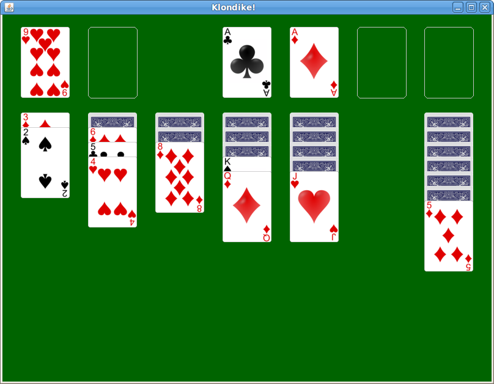

**Milestone 1** due Wednesday, Oct 28th by 11:59 PM

**Milestone 2** due Thursday, Nov 12th by 11:59 PM

# Getting Started

Download [CS201\_Assign04.zip](CS201_Assign04.zip) and import it into Eclipse.  You should see a project called **CS201\_Assign04** in your Eclipse workspace.

 This is a substantial project. Do not wait until the last minute to start it! 

Note that there is an extra credit option: see the **Insane Extra Credit** section under **Grading**.

# Your task

Your task is to implement classes that model the game of [Klondike Solitaire](http://en.wikipedia.org/wiki/Klondike_(solitaire\)).  A very complete set of JUnit tests is provided; if the tests pass, then you can have a high degree of confidence that your code is working correctly.

There are two milestones:

* Milestone 1: Complete the **Pile**, **KlondikeModel**, and **Selection** classes
* Milestone 2: Complete the **KlondikeController** class

Implementations of the **Rank** and **Suit** enumerations, and the **Card** class, are provided.  These are very similar to the ones you developed in [Lab 9](../labs/lab09.html) and [Lab 10](../labs/lab10.html).

A few other enumerations and classes are provided. The **Color** enumeration represents the color of a suit: you can call the **getColor** method on a **Suit** value to determine the suit's color (red or black.)  The **LocationType** enumeration represents the different types of locations in the game, main deck, waste pile, foundation, and tableau.  The **Location** class represents a location where a card (or cards) can be drawn from or moved to.

These are the classes you will need to complete:

* **Pile** &mdash; represents a pile of cards, similar to the **Deck** class from labs 9 and 10
* **KlondikeModel** &mdash; represents all of the **Pile**s
* **Selection** &mdash; a sequence of one or more cards taken from the main deck or a tableau pile as the first step in moving cards from one pile to another
* **KlondikeController** &mdash; handles all of the game logic and updates to the model

There are very detailed comments for each method you will need to implement.  You can also view the [API documentation](assign04javadoc/index.html) for the project.

The unit tests for **KlondikeController** are the most extensive and detailed tests, since they test the game logic.  Note that these tests use two saved game states.  You can view the image files `testgame.png` and `testgame2.png`, in the same directory as the test classes, to view these game states.

<b>Extremely important</b>: Do <i>not</i> change the name, visibility, return type, or parameter types of any of the methods in the classes you will be implementing.  I will use JUnit tests to test your implementation, and my tests will not work if you modify the API of these classes.  You are welcome to add additional methods: just don't change the existing ones.

## Rules of the game

You can see the rules of the game in action with the following demo: [klondike-obfuscated.jar](klondike-obfuscated.jar)

A game of Klondike consists of

-   the main deck, which is a pile of cards with the top card turned over
-   seven tableau piles of cards
-   four foundation piles of cards

A tableau pile consists of 0 or more hidden cards at the bottom of the pile. If a tableau pile is non-empty, then it has at least one exposed card on the top of the pile. A tableau pile may have more than one exposed card. Note that a tableau pile never contains a hidden card placed on top of an exposed card.

At the beginning of the game, the first tableau pile has one card, the second has two cards, etc.

A foundation pile contains cards of the same suit, arranged in order from Ace at the bottom of the pile to King at the top of the pile. (In Klondike, Aces are low.) There are four foundation piles, one for each suit.

On each turn, a player may either

-   draw another card from the main deck
-   move one or more cards

Drawing a card from the main deck means removing the current top card and placing it in a waste pile. The new top card on the main deck is then exposed. If the main deck is empty, then all of the cards are transferred from the waste pile back to the main deck. (Following the transfer of cards from the waste pile back to the main deck, they should appear in the order in which they originally occurred.)

Moving a card transfers one or more cards from either the main deck or a tableau pile to a tableau pile or a foundation pile. Moves must be done following the rules of the game, which are as follows:

-   Only the top card may be removed from the main deck.
-   Only an exposed card or cards may be moved. (Hidden cards may not be moved.)
-   The cards moved are placed on top of whatever pile they are moved to.
-   When multiple cards are moved (from a tableau pile), the cards cannot be removed from the "middle" of the pile. Instead, a chosen card and all cards on top of it must be moved.
-   The colors of the cards in a tableau pile must alternate red and black. Clubs and Spades are black suits, and Diamonds and Hearts are red suits.
-   When placing a card on top of a tableau pile, the rank of the placed card must be one less than the tableau pile's current top card
-   When a card or cards are moved onto an empty tableau pile, the new bottom card must be a King.

Following a move, the top card of the pile the card or cards were moved from is exposed (if the pile is not empty.)

# Grading

Milestone 1:

* Pile &ndash; 50%
* Selection &ndash; 25%
* KlondikeModel &ndash; 25%

Milestone 2:

* Initialization of game state &ndash; 10%
* Selecting cards &ndash; 15%
* Checking legality of moves &ndash; 30%
* Moving selected cards &ndash; 30%
* Canceling a selection (unselect) &ndash; 10%
* Checking win &ndash; 5%

For both milestones, points may be deducted for poor coding style, including:

* Inconsistent indentation
* Cryptic variable names
* Non-private instance fields
* Lack of comments

## Insane Extra Credit

For up to 50 points extra credit (i.e., a maximum grade of up to 150/100), implement a GUI like the one linked in the "Rules of the game" section.  It should look something like this (click for larger image):

> 

A partial GUI implementation is given to you in **KlondikeView**.  If your classes are working correctly, it should show you an initial game state.  You will need to handle mouse events to allow the player to draw a card, move cards, etc.

<b>Important</b>: Make sure all of the unit tests pass before you start working on the GUI.

# Submitting

When you are done, submit the assignment to the Marmoset server using either of the methods below.

> **Important**: after you submit, log into the submission server and verify that the correct files were uploaded. You are responsible for ensuring that you upload the correct files. I may assign a grade of 0 for an incorrectly submitted assignment.

From Eclipse
------------

If you have the [Simple Marmoset Uploader Plugin](../resources/index.html) installed, select the project (**CS201\_Assign04**) in the package explorer and then press the blue up arrow button in the toolbar. Enter your Marmoset username and password when prompted. There are two inboxes, **assign04\_ms1** and **assign04\_ms2**, corresponding to the two milestones for the assignment: make sure you choose the one that is appropriate.

From a web browser
------------------

Save the project (**CS201\_Assign04**) to a zip file by right-clicking it and choosing

> **Export...&rarr;Archive File**

Upload the saved zip file to the Marmoset server as **assign04\_ms1** (Milestone 1) or **assign04\_ms2** (Milestone 2). The server URL is

> [https://cs.ycp.edu/marmoset/](https://cs.ycp.edu/marmoset/)
