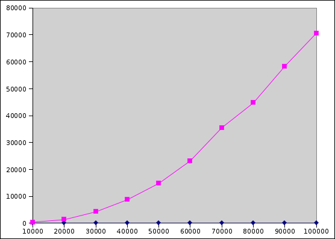

Getting Started
===============

Download [CS201\_Lab16.zip](CS201_Lab16.zip). Import it into Eclipse (**File&rarr;Import...&rarr;Existing Projects into Workspace&rarr;Archive File**.) You should see a project called **CS201\_Lab16** in the package explorer.

Your Task
=========

Part 1 - Reversing a List using get and set
-------------------------------------------

Implement the method called **reverseUsingGetAndSet** in the **Reverse** class. This method should reverse the elements of the **List&lt;E&gt;** object passed as the parameter by calling the **get(int)** and **set(int, E)** methods. A possible algorithm is suggested in the comment inside the method.

You can run the **ReverseTest** JUnit test class to test your implementation of the **reverseUsingGetAndSet** method.

Part 2 - Benchmark List reversal for ArrayList and LinkedList
-------------------------------------------------------------

Once the **reverseUsingGetAndSet** method is implemented, write a benchmark program which measures how long the reversal takes for both **ArrayList&lt;E&gt;** and **LinkedList&lt;E&gt;** objects with 10,000, 20,000, 30,000, etc. elements, up to and including 100,000 elements.

Add your benchmarking code to the **Benchmark** class. The **main** method is already partly implemented. You can call the **createArrayList** and **createLinkedList** methods to create array lists and linked lists with a specified number of elements.

Output each data point in the format

> numElements,arrayListTime,linkedListTime

where times are measured in milliseconds. (See the description for [Lab 12](lab12.html) for how to measure the execution time of a chunk of code. Don't forget to call the **System.gc()** method before starting the timing, to avoid including garbage-collection overhead in your measurement.)

You should see output something like the following:

    10000,12,442
    20000,0,1352
    30000,1,4270
    40000,1,8759
    50000,2,14825
    60000,2,23214
    70000,3,35525
    80000,2,44721
    90000,2,58349
    100000,4,70634

Note that it will probably take a few minutes for the entire benchmark to complete.

Once you have collected your data, plot it in Excel. Your plot should look something like this:

> 

Copy your Excel file into the Eclipse project. (Put it in the subdirectory of your Eclipse workspace called **CS201\_Lab16**, and in Eclipse right-click on the project and choose **Refresh**.)

Submitting
==========

**Make sure that you have included your Excel file in the project!**

When you are done, submit the lab to the Marmoset server using either of the methods below.

From Eclipse
------------

If you have the [Simple Marmoset Uploader Plugin](../resources/index.html) installed, select the project (**CS201\_Lab16**) in the package explorer and then press the blue up arrow button in the toolbar. Enter your Marmoset username and password when prompted.

From a web browser
------------------

Save the project (**CS201\_Lab16**) to a zip file by right-clicking it and choosing

> **Export...&rarr;Archive File**

Upload the saved zip file to the Marmoset server as **lab16**. The server URL is

> <https://cs.ycp.edu/marmoset/>
