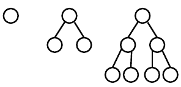

Perfect binary trees
====================

Definition: in a *perfect binary tree*, every node has either 0 or 2 child nodes, and all of the leaves (nodes with no child nodes) are at the lowest level of the tree.

Here are perfect binary trees of height 0, 1, and 2, respectively. The root node of each tree is drawn at the top.

> 

Proof by Induction
==================

In a *proof by induction*, you prove that some proposition is true for all integers [<i>b</i>..<i>n</i>], where *b* is a small value, usually 0 or 1. It has two parts:

1.  **Basis step**: Prove that the proposition is true for the integer *b*.
2.  **Induction step**: Prove that if the proposition is true for *n*, it also holds for *n* + 1.

The induction step must use valid reasoning to show that the truth of proposition *n* logically implies the truth of proposition *n* + 1. In your induction step, explain your reasoning.

Your Task
=========

**Problem 1**: Prove by induction that a perfect binary tree of height *n* has 2<i>n</i> leaves.

**Problem 2**: Prove by induction that a perfect binary tree of height *n* has 2<i>n</i>+1 − 1 nodes. Hint: use the result from problem 1 in your proof.

Write your proof in a **plain text** document. (Use either notepad or Notepad++ to compose the document.)

Submitting
==========

Upload the plain text document containing your two proofs to the Marmoset server as **lab21**. The server URL is

> <https://cs.ycp.edu/marmoset/>
