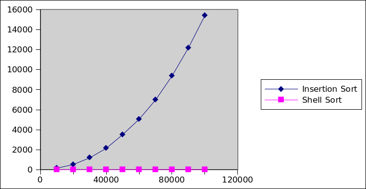

Getting Started
===============

Import [CS201\_Lab24.zip](CS201_Lab24.zip) (**File&rarr;Import...&rarr;General&rarr;Existing Projects into Workspace&rarr;Archive File**). You should see a project called **CS201\_Lab24** in the Package Explorer.

Your Task
=========

You have two tasks: implementing Shell Sort, and benchmarking Insertion Sort vs. Shell Sort.

Task 1 - Implement Shell Sort
-----------------------------

In the **Sort** class you will find an method called **insertionSortWork**:


public static<E extends Comparable<E>> void insertionSortWork(E[] arr, int startIndex, int gap) {


This method implements an insertion sort starting at the element with index **startIndex** and skipping over every **gap** number of elements. For example, the call


insertionSortWork(arr, 1, 3);


would sort every third element of the array, starting with the element at index 1.

The **insertionSort** method consists of a single call to the **insertionSortWork** method:


public static<E extends Comparable<E>> void insertionSort(E[] arr) {
    insertionSortWork(arr, 0, 1);
}


Your job is to complete the implementation of the **shellSort** method. This method should make use of the **insertionSortWork** method to carry out a shell sort on the parameter array.

You can refer to the [lecture notes](../lecture/lecture24.html) for an explanation of Shell Sort.

Suggestion: use **arr.length / 2** as the initial gap, and use the following method to decrease the gap:


private static int nextGap(int gap) {
    if (gap == 1) {
        return 0;
    }
    int next = (int) (gap / 2.2);
    if (next == 0) {
        next = 1;
    }
    return next;
}


You can use the provided **SortTest** JUnit test class to test your Shell Sort implementation.

Task 2 - Benchmark Insertion Sort vs. Shell Sort
------------------------------------------------

Your second task is to measure the amount of time Insertion Sort and Shell Sort take to sort arrays of increasing size, starting at 10,000 elements, and increasing by 10,000 up to 100,000 elements.

Modify the code in the **main** method of the **Benchmark** class. The output should look something like this:

    10000,156,5
    20000,531,5
    30000,1197,8
    40000,2143,11
    50000,3516,15
    60000,5050,18
    70000,6977,22
    80000,9368,27
    90000,12188,29
    100000,15409,33

where each data point has the form

> *numElements*,*insertionSortTime*,*shellSortTime*

Your times will likely be different, but the overall trend should be similar.

Plot the data in excel: your plot should look something like the following:

> 

Copy your Excel file into the Eclipse project. (Put it in the subdirectory of your Eclipse workspace called **CS201\_Lab24**, and in Eclipse right-click on the project and choose **Refresh**.)

Submitting
==========

When you are done, submit the lab to the Marmoset server using either of the methods below.

From Eclipse
------------

If you have the [Simple Marmoset Uploader Plugin](../resources/index.html) installed, select the project (**CS201\_Lab24**) in the package explorer and then press the blue up arrow button in the toolbar. Enter your Marmoset username and password when prompted.

From a web browser
------------------

Save the project (**CS201\_Lab24**) to a zip file by right-clicking it and choosing

> **Export...&rarr;Archive File**

Upload the saved zip file to the Marmoset server as **lab24**. The server URL is

> <https://cs.ycp.edu/marmoset/>
