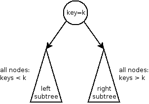
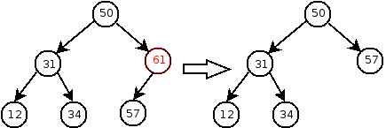
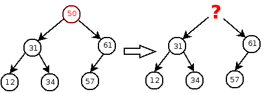
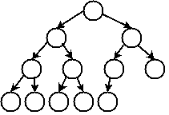
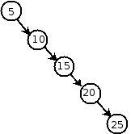

Binary Search Trees
===================

*Binary search trees* are an important data structure for maintaining a *map*.

Maps
----

A map data structure stores some number of *key/value* pairs.  Given a key, the map can look up the value associated with the key.  There are also operations to insert a new key/value pair in the map and to remove an existing key/value pair.

Here is one possible way to specify a map as a Java interface:


public interface Map<Key, Value> {
    public boolean add(Key key, Value value);
    public Value find(Key key);
    public boolean remove(Key key);
}


This interface is similar to the built-in **java.util.Map** interface.

The **add** method adds a new key/value pair to the map, returning true if the pair was added or false if the key is already present in the map.  The **find** method looks up the value associated with a given key, returning null if no matching key exists.  The **remove** method removes the key/value pair whose key is given, returning true if sucessful or false if no such key exists.

The expectation with a map data structure is that **add**, **find**, and **remove** can all be implemented *efficiently*.  A trivial map implementation, such as an unsorted linked list of key/value pairs, would require O(n) steps for all three operations.  We will see that binary search trees are capable of performing all of these operations in O(log n) time, if we are careful to avoid allowing the tree to grow into pathological configurations.

Binary Search Trees
-------------------

A binary search tree is a tree in which each node stores a key/value pair.  The keys are *ordered*, meaning that for any pair of keys *a* and *b*, it is possible to determine whether *a*\<*b*, *a*\>*b*, or *a*==*b*.  Each node obeys the *binary search tree property*:

> In a binary search tree, the left subtree contains nodes whose keys are less than the root's key, and the right subtree contains keys that are greater than the root's key.

This property applies recursively: not just at the root of the overall binary search tree, but also in every subtree:

> 

This property leads to an extremely simple algorithm for the **find** method:


Value find(Key key) {
    return findInTree(root, key);
}

Value findInTree(Node node, Key key) {
    if (node == null) return null;
    int cmp = compare(key, node.key);
    if (cmp < 0)
        return findInTree(node.left, key);
    else if (cmp > 0)
        return findInTree(node.right, key);
    else
        return node.value;
}


Starting out at the root of the overall tree, we compare the key we're searching for the key in the current node.  If equal, then we're done and we return the value in the node.  Otherwise, we continue the search in the left or right subtree depending on whether the search key is less than or greater than the current node's key, respectively.

Insertion
---------

Insertion is also a relatively simple operation.  In a process very similar to **find**, we traverse through the tree until we find a parent node where we can attach a new node containing the key/value pair being inserted.


boolean insert(key,value) {
    if (find(key) != null) return false; // key already present
    root = insertInTree(root, key, value);
}

Node insertInTree(Node node, Key key, Value value) {
    if (node == null) return new Node(key, value);
    if (compare(key, node.key) < 0)
        node.left = insertInTree(node.left, key, value);
    else
        node.right = insertInTree(node.right, key, value);
    return node;
}


Deletion
--------

Deleting a key/value pair from the tree is more complicated than inserting.  If the deleted key is in a leaf node of the tree, then there is no problem; we can just delete the node containing the key.

> 

Deleting a node with a single child is also easy: we can just delete the node and "pull up" the child to replace its deleted parent:

> 

However, if the key is in a node that has two children, we need to make sure that the children (and all of their descendents) remain in the tree.  This is difficult, since there are two children to replace the single deleted node:

> 

We can implement deletion by picking a "victim" node that is easy to delete, and then moving its contents (key and value) to the node containing the key/value pair that will actually be deleted.  The only problem is that we need to be able to find a node that is (1) easy to remove from the tree, and (2) contains a key that is valid to put in the node whose key is being removed.  There are two such nodes:

1.  The node with the maximum key in the left subtree.
2.  The node with the minimum key in the right subtree.

Let's use the node with the minimum key in the right subtree.  It is easy to see how it fits our criteria.  First, its left subtree must be empty.  (If it weren't empty, then there would be a node with a lesser key.)  Second, its key is less than all other keys in the right subtree.  Its key is also greater than all keys in the left subtree.  Thus, it is legal to copy to the root of these subtrees (which is the node containing the key we want to delete.)


boolean remove(Key key) {
    if (find(key) == null) return false;
    root = removeFromTree(root, key);
}

Node removeFromTree(Node node, Key key) {
    int cmp = compare(key,node.key);
    if (cmp < 0) {
        node.left = removeFromTree(node.left, key);
    } else if (cmp > 0) {
        node.right = removeFromTree(node.right, key);
    } else {
        // This is the node whose key we want to delete
        if (node.left == null) {
            node = node.right;
        } else if (node.right == null) {
            node = node.left;
        } else {
            // Hard case: two children
            Node minNode = findMin(node.right);
            node.right = removeMin(node.right);
            node.key = minNode.key;
            node.value = minNode.value;
        }
    }
    return node;
}

Node findMin(Node node) {
    if (node.left != null)
        return findMin(node.left);
    else
        return node;
}

Node removeMin(Node node) {
    if (node.left != null) {
        node.left = removeMin(node.left);
        return node;
    } else
        return node.right;
}


Performance
-----------

A complete binary tree is one in which

1.  Every level of the tree except the bottom level contains the maximum number of nodes: 2*l* where *l* is the level of the tree (counting the root as level 0), and
2.  All of the leaves in the bottom level of the tree are as far to the left as possible

Example:

> 

It is easy to prove that a complete binary tree has height O(log n), where n is the number of nodes in the tree.  If a binary search tree is a complete binary tree, *or approximates one closely enough*, then any binary search tree operation will complete in O(log n) steps.  This is because in the worst case, each search tree operation (insert, find, and remove) takes a number of steps proportional to the distance along a path from root to leaf: in other words, the height of the tree.

Unfortunately, it is easy to construct a binary search tree that is very far from being complete.  In particular, consider what happens if we insert a sequence of keys that are already in sorted order, such as the sequence 5, 10, 15, 20, 25:

> 

Now the tree is essentially a linked list, with O(n) worst-case running time for insert, delete, and find.  The problem is that the search tree is not properly *balanced*.  In a balanced search tree, the heights of the left and right subtrees are roughly equal everywhere in the tree.
