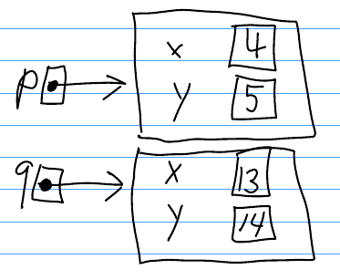
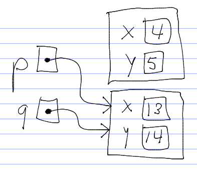
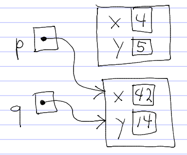

References
==========

All objects (instances of classes) and arrays in Java are accessed through *references*. A reference is the same thing as a pointer in C. A reference is a value which "points to" an object or array. You can think of a reference value as being the address (location in memory) of the object or array.

Unlike pointers in C/C++, Java references are completely opaque, meaning that they cannot be converted into a numeric address. For example, in C:


struct Point *myPoint = malloc(sizeof(struct Point));

printf("The variable myPoint contains the address %p\n", myPoint);


This code snippet will print something like

    The variable myPoint contains the address 0x601010

There is no way in Java to turn a reference into a numeric address.

Reference Assignment
====================

Because all objects and arrays in Java are accessed through references, assigning the value of one class-type or array-type variable to another variable copies the *reference*, not the *contents*.

Example:


public class Point {
  // Note: a properly written Java class would never have
  // public fields.  This is just for illustration.
  public int x;
  public int y;
}

...

Point p = new Point();

p.x = 4;
p.y = 5;

Point q = new Point();

q.x = 13;
q.y = 14;

// (1)

// Print values of x and y fields of both Point objects
System.out.println("p: x=" + p.x + ", y=" + p.y);
System.out.println("q: x=" + q.x + ", y=" + q.y);

// Assign the value of q to p: what happens?
p = q;

// (2)

System.out.println("p: x=" + p.x + ", y=" + p.y);
System.out.println("q: x=" + q.x + ", y=" + q.y);

// Change the value of q: will this affect p?
q.x = 42;

// (3)

System.out.println("p: x=" + p.x + ", y=" + p.y);
System.out.println("q: x=" + q.x + ", y=" + q.y);


What happens when this code is executed?

It is obvious that the first set of **System.out.println** statements will print the output

    p: x=4, y=5
    q: x=13, y=14

It is also reasonably obvious that the second set of **System.out.println** statements will print the output

    p: x=13, y=14
    q: x=13, y=14

This is because after the assignment **p = q;**, both **p** and **q** contain the same value.

The interesting question is: what happens when the **x** field of **q** is modified? Will the assignment affect the **x** field of **p**?

The answer, of course, is yes: following the assignment **p = q;**, both **p** and **q** *point to* the same **Point** object. In other words, the *reference* contained in **q** - what **q** points to -is copied, not the *contents* of the object **q** points to.

This is best illustrated with a "boxes and arrows" diagram. Here's what things look like at point (1) in the code example:

> 

Both **p** and **q** point to different objects.

The assignment **p = q;**, *makes p point to the same thing q points to*, as illustrated by the situation at point (2) above:

> 

So, after the assignment **q.x = 42;** is executed, the change is also reflected in the value of **p.x** at point (3):

> 

Instance methods
================

The key idea in object-oriented programming is that a user defined data type (a class) has not only member *variables* but also member *functions*. "Method" is another term for member function.

In the code above, when we printed the values of the **x** and **y** coordinates of a **Point** object, we did so using code like the following:


System.out.println("p: x=" + p.x + ", y=" + p.y);


There are two problems with this code:

-   It violates *encapsulation* - we shouldn't be directly accessing the fields of the **Point** class
-   Looking at the code does not really tell the reader what the code is doing - it's hard to understand.

We can remedy the second problem by creating an *instance method* called **print** which prints the values of the x and y coordinates of a **Point** object. Let's revise the **Point** class:


public class Point {
  public int x;
  public int y;

  public void print() {
    System.out.println("x=" + x + ", y=" + y);
  }
}


Now, if we want to print the coordinate values of **p**, we do so as:


System.out.print("p: ");
p.print();


This code is much easier to understand. Let's look closely at the second line:


p.print();


This is the "Zen" of object-oriented programming:

> find an object, call a method on it.

In the line above,

-   **p** is a **Point** object
-   **print** is a method belonging to the **Point** class, and supported by all instances (objects) of the **Point** class

The **Point** class's **print** method works because within an instance method belonging to a class, a field (e.g., **x** and **y** for the **Point** class) refers to the field residing *within the object on which the method is called*. We refer to this object as the *instance* or the *receiver*.

Enforcing Encapsulation
=======================

We can fix the first problem with the original **Point** class - violating encapsulation - by making the fields **private**. This means that only methods in the **Point** class are allowed to directly access those fields.

Encapsulation is important because it means that if we ever need to change the fields in the **Point** class -adding a field, removing a field, changing the type of a field, etc. - the only code that we will need to change will be the methods in the **Point** class. Reducing the impact of code changes becomes very important when we write larger programs. Properly encapsulated code is also easier to understand because all operations on a user-defined data type are performed by calling methods.

Here's the revised class:


public class Point {
  private int x;
  private int y;

  public void print() {
    System.out.println("x=" + x + ", y=" + y);
  }
}


Now we have a problem - our code snippet which created and used **Point** objects no longer works, because it cannot directly access the **x** and **y** fields of **Point** objects.

The **print** method takes care of printing the **x** and **y** values of a **Point** object, so we can change our original **System.out.println** statements into calls to the **Point** class's **print** method.

However, we still need a way to set the initial values of the **x** and **y** fields of a **Point** object once it's been created. One way to do this is using *setter methods*. Here's the final version of the class:


public class Point {
  private int x;
  private int y;

  public void setX(int xVal) {
    x = xVal;
  }

  public void setY(int yVal) {
    y = yVal;
  }

  public void print() {
    System.out.println("x=" + x + ", y=" + y);
  }
}


Here's the final version of our original code snippet:


Point p = new Point();

p.setX(4);
p.setY(5);

Point q = new Point();

q.setX(13);
q.setY(14);

System.out.print("p:");
p.print();
System.out.print("q:");
q.print();

p = q;

System.out.print("p:");
p.print();
System.out.print("q:");
q.print();

q.setX(42);

System.out.print("p:");
p.print();
System.out.print("q:");
q.print();


This version is considerably simpler than the original.

Constructors
============

Currently, our **Point** class needs **setX** and **setY** methods in order to be able to initialize the **x** and **y** fields of newly-created **Point** objects. We cannot access these fields directly because we made them **private** in order to enforce encapsulation.

Java provides a special kind of method whose purpose is to initialize the fields of a newly-created object: the *constructor*. Here's a revised version of the **Point** class containing a constructor method:


public class Point {
  private int x;
  private int y;

  public Point(int x, int y) {
    this.x = x;
    this.y = y;
  }

  public void print() {
    System.out.println("x=" + x + ", y=" + y);
  }
}


Using the revised Point class, we can create new **Point** objects as follows:


Point p = new Point(4, 5);


The important things to understand about constructors are

-   the name of a constructor method is the same as the name of the class
-   constructor methods have no return type
-   argument values passed when the **new** operator is called -are passed as parameters to the constructor method
-   within a constructor method, **this** (the reference to the instance) is the newly-created object whose fields are being initialized by the constructor

In the example above, the argument values are **4** and **5**, so those are the values passed as the **x** and **y** parameters to the constructor method.

Note that you may have as many constructors in a class as you would like. For example, we could add an additional constructor to the **Point** class that initializes both **x** and **y** to 0:


public Point() {
  this.x = 0;
  this.y = 0;
}


To use this constructor, we don't pass any argument values when using the **new** operator:


Point origin = new Point();

origin.print(); // prints x=0, y=0


JUnit
=====

Classes are the "parts" of an object-oriented program.

Testing makes sure that the parts work correctly.

If the individual classes don't work correctly, the overall program is probably not going to work correctly. Therefore, it is very important to have a good set of tests for the classes in your program.

[JUnit](http://junit.org/) is a *unit testing* framework for Java programs. To use JUnit, you write *test classes*. A test class is designed to test one Java class. It contains one or more *test methods*. Each test method is designed to test one particular feature of the class being tested.

General structure of a JUnit test class
=======================================

The test class's fields (member variables) store references to objects (generally, instances of the class being tested). These fields and the objects they point to are called the *test fixture*.

A test class's **setUp** method creates the test fixture objects. This method is called automatically before each test method is called. It must be marked with the **@Before** annotation.

The test methods call methods on the test fixture objects and check to see that the methods compute the correct result, typically by calling an *assertion method*. Assertion methods are methods defined by the JUnit framework specifically for checking that calls to methods in classes being tested compute the expected result. Each test method must be marked with the **@Test** annotation.

Ideally, a test method should focus on one particular method to be tested.

Kinds of JUnit assertion methods:


assertEquals(expected, actual); // assert that two values (expected and actual) are equal to each other

assertTrue(value); // assert that a boolean value is true

assertFalse(value); // assert that a boolean value is false


Most assertions in JUnit test classes will boil down to checking that the return value of a method call is equal to an expected value.

If an assertion is not satisifed, it causes the test method containing the assertion to fail. If all assertions in a test method are satisifed, the test method containing the assertion passes. The goal of testing using JUnit is that all assertions in all test methods should pass.

Eclipse has built-in support for running JUnit tests. To run a JUnit test class within eclipse, right-click on the test class, and choose **Run As...&rarr;JUnit test**. The result will be displayed in the JUnit window:

-   Green bar: all of the test methods passed
-   Red bar: at least one of the test methods failed

JUnit Example
=============

As an example, let's consider an improved version of our **Point** class:


public class Point {
  private int x;
  private int y;

  public Point(int x, int y) {
    this.x = x;
    this.y = y;
  }

  public int getX() {
    return x;
  }

  public int getY() {
    return y;
  }

  public void setX(int x) {
    this.x = x;
  }

  public void setY(int y) {
    this.y = y;
  }

  public void print() {
    System.out.println("x=" + x + ", y=" + y);
  }
}


Here's a very simple JUnit class for testing the **Point** class. We'll call the test class **PointTest**.


import static junit.framework.Assert.*;
import org.junit.Before;
import org.junit.Test;

public class PointTest {
  private Point p;
  private Point q;

  @Before
  public void setUp() throws Exception {
    p = new Point(4, 5);
    q = new Point(13, 14);
  }

  @Test
  public void testGetX() throws Exception {
    assertEquals(4, p.getX());
    assertEquals(13, q.getX());
  }

  @Test
  public void testGetY() throws Exception {
    assertEquals(5, p.getY());
    assertEquals(14, q.getY());
  }

  @Test
  public void testSetX() throws Exception {
    p.setX(55);
    assertEquals(55, p.getX());

    q.setX(101);
    assertEquals(101, q.getX());
  }

  @Test
  public void testSetY() throws Exception {
    p.setY(1331);
    assertEquals(1331, p.getY());

    q.setY(90125);
    assertEquals(90125, q.getY());
  }
}


This is a very simple example, but it demonstrates the basic idea: for each method in the **Point** class, we want to have one or more test methods which check whether or not the method behaves correctly using some test input.

Note that there is one method in **Point** that we didn't test - the **print** method. It is actually quite difficult to test methods that write output to **System.out**.

Summary
=======

Here are some of the important things you should now know:

-   a *class* is a used-defined data type, much like a struct type in C
-   an *object* is an instance of a class
-   objects are accessed by reference; a variable whose type is a class stores a reference to an object
-   two variables may contain references to the same object
-   if **p** and **q** are variables whose type is a class, then the assignment **p = q** makes **p** point to the same object that **q** points to
-   JUnit allows you to test a class by using *assertions* to check that calling methods on objects belonging to that class work correctly

