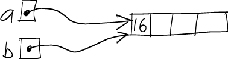
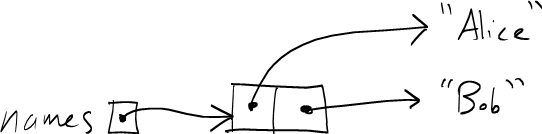

Note: The [course notes on arrays](../notes/javaArrays.html) will be useful.

Java Arrays
===========

Java arrays are a lot like C/C++ arrays.

The main difference is that Java arrays are *objects*, in the same way that instances of classes are objects. As with all objects in Java, instances of array are accessed through references. Thus, an array variable in Java is *not* the actual array: it is just a memory location in which a reference to an array may be stored.

Consider the following code:


int[] heaps;                 // (1)
heaps = new int[6];          // (2)


Line (1) creates a variable called **heaps** whose type is **int[]**, meaning "array of int". Because array variables store a reference to an array, and not the array itself, the variable does not point to any actual array yet.

Line (2) creates an array object for storing 6 **int** elements, and assigns the reference to the newly-created array to the variable **heaps**. Here's a picture:

> 

Like arrays in C and C++, Java arrays are indexed starting at 0. So, the valid range of indices for this array is 0..5.

Because arrays are accessed through references, it is possible to have two array variables storing references to the same array object. For example:


int[] a;
int[] b;

a = new int[4];
b = a;

a[0] = 15;

// (1)

System.out.println(b[0]); // prints 15

a[0] = 16;

// (2)

System.out.println(b[0]); // prints 16


As a picture, here's what's happening at point (1):

> 

Here's what's happening at point (2):

> 

Array length
============

One nice feature of Java that is not present in C and C++ is the ability to determine the exact number of elements in an array. If *arr* is an array, then


arr.length


is the number of elements in the array.

For example, the following static method will compute the sum of the elements of any array of **int** values:


public static int sum(int[] arr) {
  int sum = 0;

  for (i = 0; i < arr.length; i++) {
    sum += arr[i];
  }

  return sum;
}


Default values
==============

When an array object is created using the **new** operator, each element of the array is automatically initialized with a *default value*. The default value is 0 for all numeric element types, and the special *null* reference for all class and array element types.

Here's a code snippet that illustrates the default value for an array of **int** values:


int[] t = new int[4];
System.out.println(t[0]);  // guaranteed to print 0


Arrays of references
====================

When an array has a class or array type as its element type, it stores references. In this way, array elements are the same as any other kind of variable.

For example:


String[] names = new String[2];
names[0] = "Alice";
names[1] = "Bob";

// (1)

for (int i = 0; i < names.length; i++) {
  System.out.println(names[i]);
}


Here's what things look like at point (1):

> 

Summary
=======

-   Java arrays are really *objects* that are accessed by references, just like objects that are instances of a class
-   The **length** property of an array indicates how many elements an array object has
-   A multidimensional array in Java is really an array of references to arrays
-   Array elements are automatically initialized to a *default value*, which is 0 for numeric types and **null** for reference types (classes and arrays)

