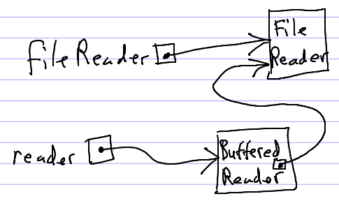

Note: The [course notes on File I/O and Exceptions](../notes/exceptionsFileIO.html) will be useful.

File I/O
========

File I/O allows a Java program to read information from files and save information to files.

There are two general kinds of file I/O: *byte* I/O and *character* I/O.

Byte I/O is useful for reading from and writing to binary files.

Character I/O is useful for reading from and writing to text files.

The **InputStream** and **OutputStream** classes are used to read and write bytes to and from files (and other sources/destinations for binary data).

The **Reader** and **Writer** classes are very much like **InputStream** and **OutputStream**, but they are used to read and write *characters* rather than bytes.

All 4 of the basic Input/OutputStream and Reader/Writer classes come in many different "flavors". For example:

-   **FileInputStream** is an **InputStream** that reads bytes from a file
-   **FileWriter** is a **Writer** that writes characters to a file

Making the situation even more complicated, some kinds of Stream and Reader/Writer classes are used as "adapters" or "wrappers" to add functionality to another Stream or Reader/Writer object. For example:

-   A **BufferedReader** object can be used as an adapter to make any **Reader** object capable of reading complete lines of text at a time.
-   A **Scanner** object can be used as an adapter to make any **InputStream** or **Reader** object capable of reading *tokens* of input

One of the keys to writing code to do file I/O in Java is knowing which classes, or combinations of classes, you need to use.

Reading characters from a file
==============================

Here's a program to read every character of text from a **FileReader**, and count the number of occurrences of the vowels A, E, I, O, and U.


package edu.ycp.cs201.countvowels;

import java.io.FileReader;
import java.io.IOException;
import java.util.Scanner;

public class CountVowels {
    public static void main(String[] args) throws IOException {
        Scanner keyboard = new Scanner(System.in);

        String fileName;
        System.out.println("Which file? ");
        fileName = keyboard.next();

        FileReader reader = new FileReader(fileName);

        int vowelCount = 0;

        while (true){
            int c = reader.read();

            if (c < 0) {
                break;
            }

            char ch = (char) c;

            ch = Character.toLowerCase(ch);
            if (ch == 'a' || ch == 'i' || ch == 'o' || ch == 'u') {
                vowelCount++;
            }
        }
        reader.close();

        System.out.println("The file contains " + vowelCount + " vowel(s)");
    }
}


Note that when the **read** method returns a negative value, it means that the reader has reached the end of the input file, and there are no more text characters to be read.

Also note that after the program is done using a Stream or a Reader/Writer, it is important to call the **close** method on the object.

Assume that the file **myFile.txt** contains the following text:

    Fourscore and seven years ago...

Running the **CountVowels** program on that file produces the following output:

<pre>
Which file?
<b>myFile.txt</b>
The file contains 7 vowel(s)
</pre>

Reading all lines of text from a file
=====================================

The **BufferedReader** class is handy for reading a text file line-by-line.

Here is a program to find the longest line in an input text file:


package edu.ycp.cs201.countvowels;

import java.io.BufferedReader;
import java.io.FileReader;
import java.io.IOException;
import java.util.Scanner;

public class FindLongestLine {
    public static void main(String[] args) throws IOException {
        Scanner keyboard = new Scanner(System.in);

        System.out.println("Which file?");
        String fileName = keyboard.next();

        FileReader fileReader = new FileReader(fileName);
        BufferedReader reader = new BufferedReader(fileReader);

        int longest = 0;

        while (true) {

            String line = reader.readLine();
            if (line == null) {
                break;
            }

            if (line.length() > longest) {
                longest = line.length();
            }
        }

        reader.close();

        System.out.println("The longest line contained " + longest + " character(s)");
    }
}


Note several interesting things going on in this program.

The **BufferedReader** object serves as an "adapter" or "wrapper" for the **FileReader**. That means that the **BufferedReader** object uses the **FileReader** object for reading characters, but adds some additional capabilities (specifically, the ability to read complete lines of text.) Here's a picture showing how this works:

> 

The **BufferedReader** object contains a reference to the underlying **FileReader** object in one of its (private) fields.

Also note that the **BufferedReader**'s **readLine** method returns the special **null** reference after all of the lines of text in the file have been read.

Finally, note that calling the **close** method on the **BufferedReader** causes the underlying

Running the program on the same text file as the previous example:

<pre>
Which file?
<b>myFile.txt</b>
The longest line contained 32 character(s)
</pre>

Writing to a text file
======================

The **FileWriter** class is useful for writing text to a text file.

Demo program:


package edu.ycp.cs201.countvowels;

import java.io.FileWriter;
import java.io.IOException;

public class WriteToFile {
    public static void main(String[] args) throws IOException {
        FileWriter writer = new FileWriter("pandp.txt");

        writer.write("It is a truth universally acknowledged, that a single man in\n");
        writer.write("possession of a good fortune, must be in want of a wife.\n");

        writer.close();

        System.out.println("File written successfully!");
    }
}


Note that when calling the **write** to write a string of text, you must manually insert newlines (**\\n**) whenever you want to end a line and begin a new line.

This program writes the first sentence of *Pride and Prejudice* to a file called **pandp.txt**. Running the program produces the following output:

    File written successfully!

After you run the program, right-click on the name of the project and choose **Refresh**. You will see a text file called **pandp.txt** appear in the project. When you open the file, you should see the two files written.

Exceptions
==========

Note that each demo program had a **main** method that looked like this:


public static void main(String[] args) throws IOException {


The **throws Exception** part is required because operations such as opening a file, reading from a file, or writing to a file can cause an *exception* to be thrown. Exceptions are a feature of the Java language for allowing programs to handle "exceptional" situations. We will talk more about exceptions next time.

Summary
=======

-   **InputStream**s and **OutputStream**s are used for binary I/O: input and output with raw *bytes* of data. A byte is an 8-bit integer. All data is represented as a sequence of bytes.
-   **Reader**s and **Writer**s are used for text I/O: input and output using text characters. Text I/O is generally more useful than binary I/O, because information stored as text is meaningful not only to computers but also to people.
-   **InputStream**s, **OutputStream**s, **Reader**s, and **Writer**s come in different "varieties". For example, a **FileReader** is a variety of **Reader** useful for reading text from a file.
-   A **BufferedReader** object can *adapt* another **Reader** object to enable it to read complete lines of text using the **readLine** method.
-   **InputStream**s, **OutputStream**s, **Reader**s, and **Writer**s should be *closed* when the program is done using them. This is done by calling the **close** method. A program that fails to close a stream, reader, or writer has a *resource leak*.
-   *Exceptions* can occur when doing input and output. An exception is an anomalous event that means that execution of the program cannot continue normally. A method can be declared to *throw* a particular kind of exception.

