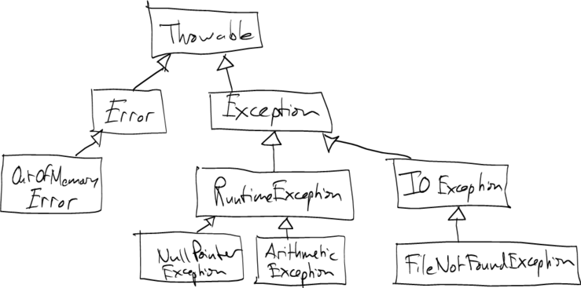

Note: The [course notes on File I/O and Exceptions](../notes/exceptionsFileIO.html) will be useful.

Exceptions
==========

An *exception* in Java is an unexpected event which makes further progress within a method impossible.

For example, we saw last time that when we try to open a file using a **FileInputStream** or **FileReader**, but the file we're trying to open doesn't exist, a **FileNotFoundException** occurs. Because the file cannot be opened, it makes no sense to continue executing the code that will read from the file.

Exceptions are objects. There are some useful methods you can call on an exception object to find out what event caused the exception.

Kinds of exceptions
===================

There are two main kinds of exceptions in Java: *checked* and *unchecked*.

A *checked* exception is one where the occurrence of the exception is expected at least occasionally: **FileNotFoundException** is a good example, because it's common for a user to type the name of a file that doesn't exist. If it is possible for a checked exception to occur in a method, the method must deal with the exception by either

1.  *handling* it using **try/catch**
2.  throwing it out of the method

Option number 2 is the one you will want to use 90% of the time. Handling an exception using **try/catch** should only be done at a point in the program where there is a reasonable way to recover from the exception.

An *unchecked* exception is one that typically indicates a bug in the program. For example, dereferencing a null reference (**NullPointerException**), or dividing by zero (**ArithmeticException**). Unchecked exceptions do not have to be dealt with explicitly, and, in general, should not be handled.

The exception hierarchy
=======================

[This will make a bit more sense when we talk about inheritance.]

Java has a hierarchy of exception classes:

> 

The boxes are the exception classes. The arrows represent *Is-A* relationships. For example, an **ArithmeticException** is a **RuntimeException**. That means that aritmetic exceptions are "kind of" runtime exception.

All exception classes that are subclasses of **Exception** but not subclasses of **RuntimeException** are checked exceptions. All other exception classes are unchecked exceptions.

Throwing an exception out of a method
=====================================

The simplest, and usually best, way to deal with an exception that can occur in a method is to *avoid dealing with it*. This option is *throwing the exception out of the method*. To throw a particular class of exceptions out of the method, add a **throws** clause to the method. Example: a method to read the first line of a file and return it as a String:


public static String readFirstLine(String fileName) throws IOException {
    FileReader fr = new FileReader(fileName);
    BufferedReader br = new BufferedReader(fr);
    String firstLine = br.readLine();
    br.close();
    return firstLine;
    // Note: there's something wrong with this method -
    //       see below under "try/finally"
}


By declaring the method **throws IOException**, any **FileNotFoundException** or **IOException** occurring when the method is executed will immediately terminate the method and *propagate the exception to the caller*. In other words, throwing an exception out of a method makes the caller deal with the exception. This is really important:

> **Throwing an exception out of a method transfers the responsibility for dealing with the exception to the caller.**

Handling an exception using try/catch
=====================================

In the event that you actually need to handle and recover from an exception, you can use a **try/catch** block.

The **try** block executes some code that might cause an exception to occur. The **catch** block executes some recovery code to be executed in the event that an exception actually does occur.

Example: here's how the code that calls the **readFirstLine** method might use a **try/catch** to handle an recover from an **IOException**:


try {
    // The readFirstLine() method might throw a
    // FileNotFoundException or an IOException
    String firstLine = readFirstLine("pandp.txt");

    System.out.println("The first line of pandp.txt is:");
    System.out.println(firstLine);
} catch (IOException e) {
    System.out.println("Error: " + e.getMessage());
}


Any number of **catch** blocks can be added to a single **try**. For example, we could handle the occurrence of a **FileNotFoundException** separately:


try {
    // The readFirstLine() method might throw a
    // FileNotFoundException or an IOException
    String firstLine = readFirstLine("pandp.txt");

    System.out.println("The first line of pandp.txt is:");
    System.out.println(firstLine);
} catch (FileNotFoundException e) {
    System.out.println("pandp.txt doesn't seem to exist, old chap!");
} catch (IOException e) {
    System.out.println("Error: " + e.getMessage());
}


Cleaning up using try/finally
=============================

Recall that we noted that something was wrong with our **readFirstLine** method.

What's wrong with the method is somewhat subtle:

-   If the file is opened successfully, **and**
-   an **IOException** occurs trying to read a line from the file, **then**
-   the reader will not be closed

We should always close streams/readers/writers when we're done using them. Exceptions can make guaranteeing that these objects are closed a bit tricky. Fortunately, a construct called **try/finally** helps us ensure that cleanup code is executed both

-   when the method completes succesfully, or
-   when the method is abruptly terminated due to an exception

Here's the fixed version


public static String readFirstLine(String fileName) throws IOException {
    FileReader fr = new FileReader(fileName);
    BufferedReader br = new BufferedReader(fr);

    try {
        String firstLine = br.readLine();
        return firstLine;
    } finally {
        br.close();
    }
}


The **finally** block is executed regardless of whether or not an exception occurs executing the code in the **try** block. This makes sure that we are guaranteed to call the **close** method on the **BufferedReader** object.

Summary
=======

-   Exceptions are anomalous events that mean that the execution of the program cannot continue normally.
-   Exceptions can be *checked* or *unchecked*.
-   A method in which a checked exception can occur must "deal with" the exception by either handling the execption using **try**/**catch** or by throwing the exception out of the method using a **throws** clause.
-   Throwing a method out of a method transfers responsibility for dealing with the exception to the caller.
-   Most of the time throwing the exception out of the method is the best choice. **try**/**catch** should only be used at points in the program where there is a reasonable way to *recover* from the exception, for example by allowing the user to re-enter some input.
-   *Runtime exceptions* are a specific kind of unchecked exception that indicate that there is a bug in the program. Programs should generally never using **try**/**catch** to handle runtime exceptions: instead, you should fix the bug so that the runtime exception does not occur.

