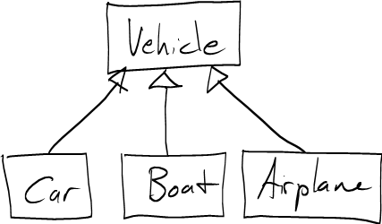

Note: The [course notes on objects, arrays, and references](../notes/objectsArraysReferences.html) will be useful.

Inheritance
===========

Inheritance is an *IS-A* relationship between two classes.

For example, consider the classes **Vehicle**, **Car**, **Boat**, and **Airplane**.

> A **Car** *is a* **Vehicle**.
> A **Boat** *is a* **Vehicle**.
> An **Airplane** *is a* **Vehicle**.

We describe IS-A relationships using a *class hierarchy diagram*:

> 

The **Car**,. **Boat**, and **Airplane** classes *inherit from* the **Vehicle** class.

Superclasses and subclasses
---------------------------

In this class hierarchy, **Vehicle** is the *superclass* of **Car**, **Boat**, and **Airplane**.

Equivalently, **Car**, **Boat**, and **Airplane** are *subclasses* of **Vehicle**.

Because classes are data types, we also describe an inheritance relationship as a *supertype*/*subtype* relationship.

When Inheritance is Useful
==========================

Inheritance is useful when you have a collection of classes which both *common characteristics* and *behavioral differences*.

The common characteristics of the classes are embodied in the *superclass*. The most important kind of commonality in classes related by inheritance is that they support a common set of *operations* (methods).

For example, let's say that **Car**, **Boat**, and **Airplane** classes support the following operations:

-   They can start a trip
-   They can move over/through terrain
-   They can end a trip

These common operations become the methods of the **Vehicle** class, which is the superclass of all three classes.

There are *behavioral* differences in the three classes because they *implement* the common operations differently:

-   A car can start a trip, move, and end a trip only where there are roads. (Airports and marinas are considered to have roads.)
-   A boat can start a trip, move, and end a trip only where there is water. (A marina is considered to have water.)
-   An airplane can move over any kind of terrain, but must start and end its trip at airports.

So, for example, if we call the **startTrip** method on an **Airplane** object, it will only succeed if the **Airplane** is currently located at an airport.

Abstract Methods and Classes
============================

Typically, the methods in the superclass that embody the common operations (methods) shared by subclasses will be *abstract*. This sense of *abstract* means that there is no way to concretely what the operation does unless we know what kind (subclass) of object it is called on.

Because they usually have abstract methods, superclasses are ususally *abstract classes*. An abstract class cannot be directly instantiated.

For example, if I told you I arrived at work in a **Vehicle**, that tells you nothing about whether I arrived by ground, air, or water. That's because you don't know what specific *kind* of **Vehicle** I arrived in.

The Liskov Substitution Principle, Polymorphism
===============================================

A simple rule called the *Liskov Substitution Principle* explains how to use inheritance in a program. It states:

> Anywhere in a program an instance of a superclass may be used, an instance of a subclass may be used.

So, if we have a method that takes a parameter whose type is **Vehicle**, we can pass that method a reference to a **Car**, **Boat**, or **Airplane**, since those are all subclasses of **Vehicle**.

The Liskov Substitution Principle allows object-oriented programs to exhibit *polymorphism*. Polymorphism means that a variable with type *A* might, when the program runs, actually refer to an object of type *B*, *C*, *D*, etc. This is possible as long as *B*, *C*, and *D* are all subclasses of *A*.

An Example
==========


public enum Terrain {
    ROAD,
    AIRPORT,
    WATER,
    MARINA,
    FIELD,
    FOREST,
    MOUNTAIN;
}

public abstract class Vehicle {
    public abstract boolean startTrip(Terrain t);
    public abstract boolean endTrip(Terrain t);
    public abstract boolean move(Terrain t);
}

public class Car extends Vehicle {
    public boolean endTrip(Terrain t) {
        if ( t == Terrain.AIRPORT || t == Terrain.MARINA ) {
            return true;
        } else {
            return false;
        }
    }

    public boolean move(Terrain t) {
        if ( t == Terrain.AIRPORT || t == Terrain.MARINA || t == Terrain.ROAD ) {
            return true;
        } else {
            return false;
        }
    }

    public boolean startTrip(Terrain t) {
        if ( t == Terrain.AIRPORT || t == Terrain.MARINA ) {
            return true;
        } else {
            return false;
        }
    }
}


A **Trip** consists of a sequence of **Terrain** values:


public class Trip {
    private Terrain[] hops;

    public Trip(int numHops) {
        if (numHops < 2) {
            throw new IllegalArgumentException("Trips must have at least a start and finish");
        }
        this.hops = new Terrain[numHops];
    }

    public void setHop(int hop, Terrain t) {
        hops[hop] = t;
    }

    public boolean isTripPossible(Vehicle v) {
        // Check the first hop
        if (!v.startTrip(hops[0])) {
            return false;
        }

        // Check all hops between the first and last
        for (int i = 1; i < hops.length - 1; i++) {
            if (!v.move(hops[i])) {
                return false;
            }
        }

        // Check the last hop
        if (!v.endTrip(hops[hops.length - 1])) {
            return false;
        }

        // success!
        return true;
    }
}


The **isTripPossible** method of the **Trip** class takes a **Vehicle** as a parameter, and returns true or false depending on whether or not the **Vehicle** can successfully complete the trip. We see polymorphism at work because an instance of any subclass of **Vehicle** may be passed to **isTripPossible**.

We can use the **Trip** class to write JUnit tests which test the **Car** class.

For example, a trip starting at an airport, continuing through roads, and ending at a marina is a legal trip. A trip blocked by a terrain type inaccessible to a **Car**, such as **WATER**, is not a legal trip.


public class CarTest extends TestCase {
    private Trip legalTrip;
    private Trip illegalTrip;
    private Car myCar;

    protected void setUp() throws Exception {
        // a Trip that can be completed by Car
        legalTrip = new Trip(4);
        legalTrip.setHop(0, Terrain.AIRPORT);
        legalTrip.setHop(1, Terrain.ROAD);
        legalTrip.setHop(2, Terrain.ROAD);
        legalTrip.setHop(3, Terrain.MARINA);

        // a Trip that cannot be completed by Car
        // because it contains a hop through WATER
        illegalTrip = new Trip(5);
        illegalTrip.setHop(0, Terrain.AIRPORT);
        illegalTrip.setHop(1, Terrain.ROAD);
        illegalTrip.setHop(2, Terrain.ROAD);
        illegalTrip.setHop(3, Terrain.WATER);   // Not possible by Car!
        illegalTrip.setHop(4, Terrain.MARINA);

        myCar = new Car();
    }

    public void testLegalTrip() throws Exception {
        assertTrue(legalTrip.isTripPossible(myCar));
    }

    public void testIllegalTrip() throws Exception {
        assertFalse(illegalTrip.isTripPossible(myCar));
    }
}

