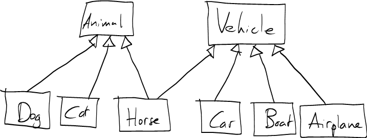

Note: The [course notes on objects, arrays, and references](../notes/objectsArraysReferences.html) will be useful.

Instanceof, Type casts
======================

Sometimes it is useful to find out whether a superclass reference points to an instance of a particular subclass. We can do so using the **instanceof** operator. For example:


public void startTrip(Vehicle v) {
  if (v instanceof Airplane) {
    // v points to an instance of Airplane
  }


Once we know for certain that a reference refers to an instance of a particular subclass, we can use a *type cast* to convert the reference to the subclass type. E.g.:


public void startTrip(Vehicle v) {
  // Note: in general, this is not a good idea
  if (v instanceof Airplane) {
    Airplane a = (Airplane) v;
    a.retractLandingGear();
  }


Both **instanceof** and type casts should be used sparingly, if at all. It is better object-oriented design to define common operations supported by *all* subclasses, and let the subclasses implement them appropriately, rather than sprinkling the code with **instanceof** checks leading to casts and calling subclass methods.

java.lang.Object
================

Every class in Java is a subclass of the class **java.lang.Object**. If you don't specify a superclass when you define a class, it will be a direct subclass of **java.lang.Object**.

One reason that the **Object** class is useful is that it defines some methods that are useful for all objects. For example, the **equals** method:


public boolean equals(Object o) {
  ...


This method can be called on an object to compare it for equality with another object:


public void someMethod(String s1, String s2) {
  if (s1.equals(s2)) {
     // s1 and s2 are identical
  }
}


Note that the equality operator (==) compares two references to see whether or not they point to the same object. Demonstration:


String s1, s2;
char[] a = { 'F', 'o', 'o', 'b', 'a', 'r' };
s1 = "Foobar";
s2 = "";
for (int i = 0; i < a.length; i++) {
  s2 = s2 + a[i];
}
System.out.println(s1.equals(s2)); // prints "true"
System.out.println(s1 == s2);      // prints "false"


So: if you want to compare two objects to see if they have *the same contents*, use the **equals** method, not the equality operator.

You can define your own **equals** method in your own classes. It should look like this:


public class MyClass {
  private int value;

  ...

  public boolean equals(Object o) {
    if (o == null || !(o instanceof MyClass)) {
      return false;
    }
    MyClass other = (MyClass) o;
    if (this.value == other.value) { // compare fields
      return true;
    } else {
      return false;
    }
  }


Another useful methods in **java.lang.Object** is **toString** (convert an object into a string).

Another reason why the **Object** class is useful is that it can be used as a *generic type*: we will explore this idea further in [Lecture 10](lecture10.html).

Interfaces
==========

An interface is a completely abstract class. It can define abstract methods, but cannot define fields or concrete methods.

When a class is a subclass of an interface, we say that the class *implements* the interface.

Interfaces are useful because, while a class may have only one superclass, it may implement any number of interfaces.

Example:

> 

A **Horse** is both a **Vehicle** and an animal. It can support operations defined for vehicles---**startTrip**, **move**, **endTrip**---and can also support any operations defined for animals, such as **numberOfLegs**, **makeSound**, etc.

We can make this work in Java as long as either **Vehicle** or **Animal** is an interface. Since we have made **Vehicle** a class, we'll make **Animal** an interface.


public interface Animal {
  public int numberOfLegs();
  public void makeSound();
}

public class Horse extends Vehicle implements Animal {
  public Horse(double maxSpeed) {
    super(maxSpeed);
  }

  public boolean startTrip(Terrain t) {
    return canMove(t);
  }

  public boolean move(Terrain t) {
    return canMove(t);
  }

  public boolean endTrip(Terrain t) {
    return canMove(t);
  }

  private boolean canMove(Terrain t) {
    // horses can go anywhere except water
    return t != Terrain.WATER;
  }

  public double getSpeed(Terrain t) {
    if (t == Terrain.FIELD) {
      // half speed
      return 0.5 * getMaxSpeed();
    } else if (t == Terrain.MOUNTAIN) {
      // quarter speed
      return 0.25 * getMaxSpeed();
    } else {
      return getMaxSpeed();
    }
  }

  public int numberOfLegs() {
    return 4;
  }

  public void makeSound() {
    System.out.println("Neigh");
  }
}


Comparable
==========

Java defines a number of standard interfaces that you can have your own classes implement. One such interface is **java.lang.Comparable**. The **Comparable** interface looks something like this:

    public interface Comparable {
      public int compareTo(Object o);
    }

The **compareTo** method is similar to the **equals** method defined in **java.lang.Object**, except that instead of comparing against another object to see if the objects are equal, **compareTo** compares against another object to see if it is less than, equal to, or greater than the instance on which **compareTo** is called. The return value indicates the result of the comparison:

-   a negative value means that this object is less than the compared (parameter) object
-   zero means the objects are equal
-   a positive value means that this object is greater than the compared (parameter) object

This is useful to allow objects to be ranked against each other.

For example, the **String** class implements the **Comparable** interface. Its **compareTo** method compares string values using lexicographical comparison, which is a generalization of alphabetical order.

Implementing Comparable
-----------------------

Say we have an **Employee** class:


public class Employee {
  private String lastName;
  private String firstName;
  private int salary;

  ...


Let's say we want to have **Employee** implement the **Comparable** interface. We must define *how* **Employee** objects are to be compared. We'll choose that **Employee** objects are compared first by last name, then by first name, then by salary:


public int compareTo(Object o) {
  Employee other = (Employee) o;

  int cmp;

  // compare last names
  cmp = this.lastName.compareTo(other.lastName);
  if (cmp != 0) {
    return cmp;
  }

  // last names are the same - compare first names
  cmp = this.firstName.compareTo(other.firstName);
  if (cmp != 0) {
    return cmp;
  }

  // last and first names are the same - compare salaries
  if (this.salary < other.salary) {
    return -1;
  } else if (this.salary == other.salary) {
    return 0;
  } else {
    return 1;
  }
}

