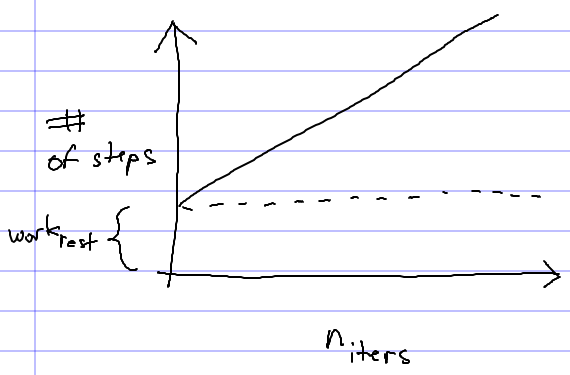

You may also refer to the [course notes](../notes/analysisOfAlgorithms.html).

Analysis of algorithms
======================

Analysis of algorithms is the study of how algorithms behave when they are executed. One of the most important characteristics of any algorithm is how long the algorithm will require to complete when run on an input of a particular size. In particular, we would like to know how the running time of an algorithm increases as the input size increases.

Implementing ArrayList
======================

As a concrete example, let's consider an implementation of the generic **ArrayList** class. An ArrayList uses an array of references as its internal storage. The methods of the ArrayList class use this array to store the elements added to the object. When a call to the **add** method is made while the array is full, a larger array must be allocated, and the original elements copied from the old storage array to the new storage array. Once this has been done, the old storage array is discarded, and the new storage array becomes the ArrayList's storage.


public class ArrayList<E> {
    private static final int INITIAL_CAPACITY = 4;

    private E[] storage;
    private int numElements;

    public ArrayList() {
        this.storage = (E[]) new Object[INITIAL_CAPACITY];
        this.numElements = 0;
    }

    public int size() {
        return numElements;
    }

    public void add(E value) {
        if (numElements >= storage.length) {
            grow();
        }
        storage[numElements] = value;
        numElements++;
    }

    public E get(int index) {
        if (index < 0 || index >= numElements) {
            throw new IndexOutOfBoundsException();
        }
        return storage[index];
    }

    public void set(int index, E value) {
        if (index < 0 || index >= numElements) {
            throw new IndexOutOfBoundsException();
        }
        storage[index] = value; 
    }

    private void grow() {
        E[] larger = (E[]) new Object[numElements * 2];
        for (int i = 0; i < storage.length; i++) {
            larger[i] = storage[i];
        }
        storage = larger;
    }
}


The basic idea is that as calls to the **add** method are made, the added element values are stored in the first unused element of the storage array. When the current storage array becomes full, a new (larger) one is allocated by the private **grow** method.

The **get** and **set** methods simply retrieve elements from and store elements to elements of the storage array.

Some tests:


import junit.framework.TestCase;

public class ArrayListTest extends TestCase {
    private ArrayList<Integer> empty;
    private ArrayList<String> names;

    protected void setUp() throws Exception {
        empty = new ArrayList<Integer>();

        names = new ArrayList<String>();
        names.add("Alice");
        names.add("Bob");
        names.add("Carl");
        names.add("Delores");
    }

    public void testSize() throws Exception {
        assertEquals(0, empty.size());
        assertEquals(4, names.size());
    }

    public void testAdd() throws Exception {
        names.add("Eli");
        assertEquals(5, names.size());
        assertEquals("Eli", names.get(4));

        // make sure the previous values are still there
        assertEquals("Alice", names.get(0));
        assertEquals("Bob", names.get(1));
        assertEquals("Carl", names.get(2));
        assertEquals("Delores", names.get(3));
    }

    public void testSet() throws Exception {
        names.set(2, "Cornelius");
        assertEquals("Cornelius", names.get(2));
    }
}


Note that because the initial capacity of the storage array is 4, when **testAdd** adds a fifth element, the storage array is re-allocated.

Implementing remove(int)
========================

The **remove** method takes an integer index, and removes the element at that index from the ArrayList. Any elements to the right of the index must be moved over one position to the left. The removed element is returned.

Implementation:


public E remove(int index) {
    E value = get(index);
    for (int i = index + 1; i < size(); i++) {
        set(i - 1, get(i));
    }
    numElements--;
    return value;
}


And a test:


public void testRemove() throws Exception {
    String gone = names.remove(1);
    assertEquals("Bob", gone);

    assertEquals(3, names.size());
    assertEquals("Alice", names.get(0));
    assertEquals("Carl", names.get(1));
    assertEquals("Delores", names.get(2));
}


Analysis of the remove algorithm
================================

We can think of the **remove** method as implementing an algorithm: the *ArrayList remove algorithm*.

When the program calls the **remove** method, how long will it take to complete? This depends on a wide variety of factors:

-   how many elements are in the ArrayList
-   which element is being removed
-   how fast the computer is
-   how good the Java Virtual Machine's Just-In-Time compiler is
-   whether or not the ArrayList and its storage array currently reside in the CPU cache
-   etc., etc.

Because of the number of factors involved, this question cannot be answered precisely.

We can still usefully characterize the performance of the underlying algorithm by removing from consideration all of the incidental factors (how fast the CPU is, etc.) and focusing on the mathematical parameters of the algorithm. We have two such parameters:

-   the number of elements in the ArrayList
-   the index of the element being removed

So, based on these parameters, how can we characterize the running time of the algorithm? The key is that we will count the number of *constant-time steps* the algorithm will take. A constant-time step is simply some sequence of operations that is guaranteed to complete in a constant amount of time; any finite sequence of instructions is a constant-time step.

Looking at the code of the **remove** method, we notice that the only construct which might not complete in a constant amount of time is the loop. We also note that the amount of work outside the loop is constant, and the amount of work done inside one iteration of the loop is constant. So, we should expect the amount of time it takes the method to complete to be

> (<i>n</i>iters &sdot; <i>work</i>loop) + <i>work</i>rest

where <i>n</i>iters is the number of loop iterations, <i>work</i>loop is the (constant) amount of work done per loop iteration, and <i>work</i>rest is the (constant) amount of work done outside the loop. We can thus think of the running time of the algorithm as being a function of <i>n</i>iters, the number of iterations executed by the loop.

If we plot this function, it looks like this:

> 

As <i>n</i>iters becomes large, the significance of <i>work</i>rest diminishes. So, we say that the running time of the algorithm is linear with respect to <i>n</i>iters. This is just a fancy way of saying that the running time (as <i>n</i>iters becomes sufficiently large) is proportional to the number of times the loop executes.

So, what is <i>n</i>iters? It is a function of two parameters:

> <i>n</i>iters = (<i>n</i> - 1) - <i>i</i>

where <i>n</i> is the number of elements in the ArrayList, and <i>i</i> is the index of the element being removed.

So, when we call **remove** on an ArrayList with *n*/*i* elements, it will take a constant amount of time to remove the last element, and time proportional to *n* - 1 to remove the first element. This makes sense: more work is required to shift over the elements to the right of the one we're removing the closer the removed element is to the beginning of the array.

Worst case
----------

Typically, what we want to know when analyzing the running time of an algorithm is the *worst-case* running time; what is the maximum number of steps that will be required for the algorithm to complete. For the ArrayList remove algorithm, the worst case is removing the first element, which (as mentioned above) requires time proportional to

> <i>n</i> - 1

ignoring <i>work</i>rest.

Average case
------------

Sometimes, we might be interested in knowing what the *average-case* running time is. To say something meaningful about the average case, we need to know what possible inputs the algorithm might receive, and a probability distribution specifying how likely each possible input is. For the case of the ArrayList remove algorithm, the possible inputs are the index values 0 .. *n*-1. Let's say that all inputs are equally likely. That means the average case running time will be

> ((<i>n</i>-1) + (<i>n</i>-2) + ... + 1 + 0) / <i>n</i>

ignoring <i>work</i>rest.

The sum of the series

> (<i>n</i>-1) + (<i>n</i>-2) + ... + 1 + 0

is

> (<i>n</i> / 2) &sdot; <i>n</i>

[Why? Google "gauss sum integers".]

So, the average case running time works out to

> ((<i>n</i> / 2) &sdot; <i>n</i>) / <i>n</i>

which simplifies to <i>n</i> / 2.
