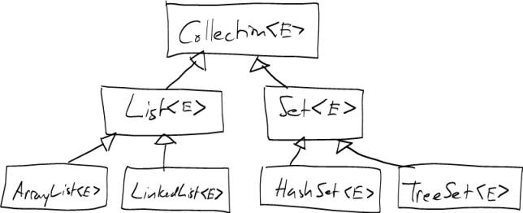
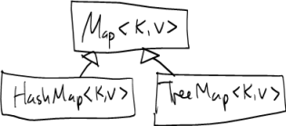

Collections
===========

As we've discussed, a *collection* is an object whose purpose is to store a collection of references to other objects. Java provides a number of built-in classes to implement collections; we have used one, **ArrayList&lt;E&gt;**, already.

Java defines an interface called **Collection&lt;E&gt;** to define operations (methods) common to all collection classes. It has a number of useful methods, including:

-   **boolean add(E e)** - add an element to the collection
-   **boolean addAll(Collection&lt;? extends E&gt; c)** - add all the elements of another collection to this collection
-   **boolean contains(Object o)** - determine whether or not this collection contains the object **o**
-   **boolean removeAll(Collection&lt;?&gt; c)** - remove all of the elements contained in **c** from this collection
-   **Iterator&lt;E&gt; iterator()** - returns an iterator for traversing the elements

There are two important kinds of collections that are sub-interfaces of the **Collection&lt;E&gt;** interface: **List&lt;E&gt;** and **Set&lt;E&gt;**.

The **List&lt;E&gt;** interface is implemented by collection classes that store a sequence of elements. The order in which the elements appear in the sequence is the order in which they were added to the collection (assuming that the elements were added to the end of the collection).

Some methods in the **List&lt;E&gt;** interface are:

-   **E get(int index)** - get the element at the specified index
-   **E remove(int index)** - remove the element at the specified index (and return it)

The **Set&lt;E&gt;** interface is implemented by collection classes that behave like mathematical sets:

-   duplicate elements (those comparing as equal to each other) are not allowed to be present simultaneously
-   the order of the elements (as seen when iterating using an iterator) may be different that the order in which the elements were added

Classes implementing the **Set&lt;E&gt;** interface typically have a very efficient implementation of the **boolean contains(Object o)** method, for testing whether or not a particular object is a member of the set.

Here is a class hierarchy diagram showing the **Collection&lt;E&gt;**, **List&lt;E&gt;**, and **Set&lt;E&gt;** interfaces, and the most commonly-used implementations of those interfaces:

> 

We have already seen and used the **ArrayList&lt;E&gt;** class. We will investigate each of other classes (**LinkedList&lt;E&gt;**, **HashSet&lt;E&gt;**, and **TreeSet&lt;E&gt;** in the coming weeks.

Maps
====

A *map* is a data structure which maps a set of *keys* to a corresponding set of *values*. For example, a phone book is like a map: the keys are names and the values are phone numbers.

One way to think about maps is that they are like arrays, but instead of requiring the index type to be **int**, *any* type may be used as the index.

Here are some of the methods in the **Map&lt;K,V&gt;** interface:

-   **V put(K key, V value)** - add a new entry associating a given key with a given value. Returns previous value associated with the key (null if none).
-   **V get(K key)** - returns the value currently associated with the given key (null if none)

In the same way that implementations of the **Set&lt;E&gt;** interface contain a very efficient implementation of the **contains(Object o)** method, implementations of **Map&lt;K, V&gt;** contain a very efficient implementation of the **V get(Key y)** method.

Note that the **Map&lt;K, V&gt;** interface has two type parameters, one (**K**) to represent the type of the keys, and another (**V**) to represent the type of the values. For example, if we had classes **Name** and **PhoneNumber**, then a phone book could be represented as follows:


Map<Name, PhoneNumber> phoneBook;


There are two main implementations of the **Map&lt;K, V&gt;** interface: **HashMap&lt;K, V&gt;** and **TreeMap&lt;K, V&gt;**:

> 

We will learn about both implementations in the coming weeks.

Iterators
=========

An *iterator* is a functor whose purpose is to traverse the elements of a collection.

Conceptually, an interface is a "cursor". At any given time, an iterator may be positioned before any element in the collection, or may be positioned at the end of the collection. Initially, an iterator is positioned before the first element.

In Java, all iterator classes implement the interface **Iterator&lt;E&gt;** Here are its methods:

-   **boolean hasNext()** - returns true if the iterator is positioned before an element, false if it is positioned at the end of the collection
-   **E next()** - moves the iterator forward by one position, returning the element that was just passed over by the iterator
-   **void remove()** - removes the element most recently returned by the **next** method

Iterators serve two purposes. First, the allow the creation of generic algorithms that can work with any kind of collection. Such algorithms can use an iterator to traverse the elements of the collection without having to know anything about how the collection is implemented.

The second purpose is to allow elements to be removed safely while a traversal of the collection is in progress. For example, consider the following method, intended to remove all of the even integers from a list:


public static void removeEvens(List<Integer> nums) {
    for (int i = 0; i < nums.size(); i++) {
        if (nums.get(i) % 2 == 0) {
            nums.remove(i);
        }
    }
}


This method does not work: calling the **remove** element shifts the positions of the elements coming after the removed element, causing the index variable to skip over one of the elements.

Using an iterator solves this problem:


public static void removeEvens(List<Integer> nums) {
    Iterator<Integer> i = nums.iterator();

    while (i.hasNext()) {
        Integer val = i.next();
        if (val % 2 == 0) {
            i.remove();
        }
    }
}


All subclasses of **Collection&lt;E&gt;** have a method called **iterator** which returns an iterator object positioned just before the first element of the collection.
