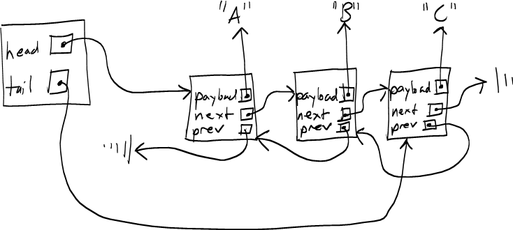

Lists
=====

A *list* is a data structure representing an ordered sequence of values. Each element of a list has an integer index: 0 for the first element, 1 for the second element, etc.

Java has two built-in classes implementing lists: **ArrayList** and **LinkedList**. Each uses a different underlying low-level data structure to store the element values. As we have seen, and **ArrayList** uses an array. A **LinkedList**, as the name suggests, uses a *linked list*.

Because of the differing underlying data structures, the worst-case running time (and average-case running time) of some of the list operations is sometimes different for the two classes. In all cases, the worst-case running time of any operation is O(N), where N is the number of elements stored in the list.

ArrayList
=========

Here are the worst-case and average-case running times for the important list operations:

> Operation|Worst-case|Average-case
> ---------|----------|------------
> add(E elt)|O(N)|O(1)
> get(int index)|O(1)|O(1)
> set(int index, E elt)|O(1)|O(1)
> remove(int index)|O(N)|O(N)
> remove using Iterator|O(N)|O(N)

Although the **add** method might take O(N) time in the worst case (if the storage array needs to be re-allocated), the average case is O(1), assuming that the size of the storage array is doubled each time it is re-allocateed. (See the [course notes on arrays](../notes/javaArrays.html) for details.)

The **get** and **set** methods are O(1) because they simply involve accessing a single element of the storage array.

Removing an element from an **ArrayList**, either by calling the **remove(int)** method on the **ArrayList** itself, or calling the **remove()** method on an iterator object created by the **ArrayList**, takes O(N) time in both the worst case and the average case, due to the need to shift all elements following the removed element one position to the left.

LinkedList
==========

A *linked list* is a data structure for storing a sequence of element values. Each value is stored in one *node* in the linked list. The nodes form a chain: each node contains a reference to the node containing the next element in the list. For a *doubly-linked list*, each node also contains a reference to the node containing the preceeding element in the list.

Because the last node in the list has no next node, its next reference is set to null. Likewise, in a doubly-linked list, the first node in the list has no previous node, so its previous reference is set to null.

A typical implementation of a collection class based on a linked list as its underlying data structure typically has two fields, a *head pointer* and a *tail pointer*. The head pointer contains a reference to the first node in the list, and the tail pointer contains a reference to the last node in the list.

Here is a picture of a doubly-linked list containing the string values "A", "B", and "C":

> 

As Java classes:


// Represents a single node in a double-linked list
public class LLNode<E> {
    public E payload;
    public LLNode<E> prev;
    public LLNode<E> next;
}

// Represents the entire list
public class LinkedList<E> implements List<E> {
    private LLNode<E> head;
    private LLNode<E> tail;

    // ...methods...
}


Note that although the fields of the **LLNode&lt;E&gt;** class are public, we are not violating encapsulation because no code outside of the methods of the **LinkedList&lt;E&gt;** class will ever directly access an instance of **LLNode&lt;E&gt;**.

Later in the semester we will investigate in detail how to implement a collection based on a linked list, such as the built-in Java **LinkedList&lt;E&gt;** class. For now, it is important to understand how the representation of the underlying data structure---a linked list of nodes---affects the efficiency of the list operations.

> Operation|Worst-case|Average-case
> ---------|----------|------------
> add(E elt)|O(1)|O(1)
> get(int index)|O(N)|O(N)
> set(int index, E elt)|O(N)|O(N)
> remove(int index)|O(N)|O(N)
> remove using Iterator|O(1)|O(1)

The **add(E)** operation is now guaranteed to complete in O(1) time in the worst case.

The **get(int)** and **set(int, E)** operations now take O(N) in both the worst case and the average case. The reason is that the only way to access an arbitrary node in a linked list is to start at the beginning of the list (or, in a doubly-linked list, the end) and advance one node at a time through the chain of nodes. The can be done in O(1) time for the first and last nodes, but for nodes in the middle of the list, will require an arbitrary amount of work bounded by O(N).

The **remove(int)** method also is O(N) in the worst case and average case, for the same reason as **get** and **set**: it requires a traversal to an arbitrary node of the list.

Interestingly, calling the **remove()** method on an iterator object connected to a **LinkedList&lt;E&gt;** is guaranteed to complete in O(1) time. The reason is that an iterator for a **LinkedList&lt;E&gt;** object keeps track of which node contains the current element. If it needs to remove the most-recently-returned element, it can do so in a constant number of steps, because it is already "positioned" in the right place in the chain of nodes.
