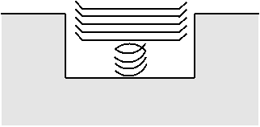
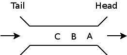

Stacks and Queues
-----------------

An ArrayList is a random-access data structure: we can efficiently (O(1)) access any element in the collection.  However, arbitrary removals are not efficient.

A LinkedList is a sequential-access data structure: we can efficiently access one element after another (starting at the beginning, or either end for a doubly-linked list).  Arbitrary removals are efficient (O(1)) if we have an iterator positioned at the location of the removed element.

Stacks and queues are abstract data types representing a collection of elements providing restricted access to the elements:

- a stack is a first in, last out data structure (LIFO)
- a queue is a first in, first out data structure (FIFO)

Stacks
------

A stack interface:


public interface Stack<E> {
    public boolean isEmpty();
    public void push(E element);
    public E pop();
    public E peek(); // get the top element
}


[Note: in Java, **java.util.Stack** is actually a concrete class, not an interface. However, it supports all of the above methods.]

You can ask if the stack is empty, push an element onto the top of the stack, pop the current top element off the stack (and return it), and get the top element on the stack.

Analogy: cafeteria trays.  You can put a new tray on top, or take the top tray off, but you can't access any of the trays underneath:

When we draw a stack visually, it looks like a bucket with a stack of elements inside.  For example, here is the stack that would result by performing the operations

1. push "A"
2. push "B"
3. push "C"

on an empty stack:

"C" is the top element in this stack.

Stacks are useful in situations where earlier input must be *balanced* with later input.

Example stack algorithm: balancing parentheses and brackets.

> Input string | result
> ------------ | ------
> Data structures (such as stacks [and queues]) | correct
> Data structures (such as stacks [and queues)] | incorrect

Algorithm: when you see an opening delimiter ("(" or "["), push it on the stack.  When you see a closing delimiter (")" or "]"), pop an opening delimiter off the stack and make sure that it matches the closing delimiter.

If you see a closing delimiter when the stack is empty, that means you saw something like this:

> Hello world)

If the stack is not empty at the end of the input sentence, then there was an opening delimiter with no matching close delimiter:

> \[Hello world

Try this algorithm on paper to convince yourself that it works.

### Preconditions and postconditions

Operations (methods) on a data structure often have *preconditions* and *postconditions*.  A precondition is something that must be true in order for the operation to work correctly.  A postcondition is something that is guaranteed to be true after the operation is performed (as long as the preconditions were satisfied.)

Stacks have the following pre and post conditions:

> Operation | Precondition | Postcondition
> --------- | ------------ | -------------
> isEmpty | none  | returns true if the stack is empty, false if not
> peek | !isEmpty | returns top element
> push | none | element pushed is new top element
> pop | !isEmpty | returns top element, stack size decreases by 1

In general, the *caller* of a method is responsible for making sure that preconditions are satisfied before the method is called, and the method itself (the *callee*) is responsible for making sure that the postconditions are satisfied when the method returns.

When a precondition of a method is violated, the right thing to do is to throw a **RuntimeException** (or a subclass).  Violations of preconditions and postconditions are bugs in the program, so a runtime exception makes sure that the bug is obvious when the program is executed.

### Implementing a Stack

If we already have an implementation of a List data type, then it is trivial to adapt the list implementation in order to implement a stack.

Observation:

> Operation | ArrayList | LinkedList
> --------- | --------- | ----------
> size | O(1) | O(1)
> append | O(1) | O(1)
> prepend | O(N) | O(1)
> getLast | O(1) | O(1)
> getFirst | O(1) | O(1)
> removeLast | O(1) | O(N)/O(1)
> removeFirst | O(N) | O(1)

So, depending on whether the list implementation is array-based or linked-list-based, we can map the stack operations onto list operations as follows:

> Operation | ArrayList | LinkedList
> --------- | --------- | ----------
> push | append | prepend
> pop | removeLast | removeFirst
> peek | getLast | getFirst
> isEmpty | size | size

Example:


public class MyStack<E> implements Stack<E> {
    private ArrayList<E> list;
    
    public MyStack() {
        list = new ArrayList();
    }
    
    public boolean isEmpty() {
        return list.size() == 0;
    }
    
    public void push(E element) {
        list.append(element);
    }
    
    public E pop() {
        E val = peek();
        list.remove(list.size() - 1);
        return val;
    }
    
    public E peek() {
        list.get(list.size() - 1);
    }
}


An implementation based on LinkedList would be very similar, except that we'd push to and pop from the beginning (head) of the list, since that's guaranteed to be efficient for both singly- and doubly-linked lists.

Queues
------

A queue interface:


public interface Queue<E> {
    public boolean isEmpty();
    public void add(E element);  // enqueue an element at the tail of the queue
    public E remove();           // dequeue an element from the head of the queue
}


Element values enter at one end of the queue and leave at the other.  It's like a line at a bank; customers are served in the order in which they enter the line.

The usual way to draw a queue is as follows:

This queue shows the results of enqueuing (adding) "A", then "B", then "C" to the queue.

### Preconditions and postconditions

> Operation | Precondition | Postcondition
> --------- | ------------ | -------------
> add(e) | --- | e is new tail element
> remove() | !isEmpty() | removes and returns head element
> isEmpty | --- | returns true if empty, false if not

### Implementing a Queue

Interestingly: we can easily adapt a linked list to implement a queue:


public class MyQueue<E> implements Queue<E> {
    private LinkedList<E> list;
    
    public MyQueue() {
        this.list = new LinkedList<E>();
    }
    
    public boolean isEmpty() {
        return list.size() == 0;
    }
    
    public void add(E element) {
        list.addFirst(element);
    }
    
    public E remove() {
        E val = list.get(0);
        list.remove(0);
        return val;
    }
}


Note that each operation is O(1).  [Discuss: why?]

However, there is no way to adapt an array-based list directly and still get O(1) running time for the queue operations.  The problem is that element values must be enqueued (added) and dequeued (removed) at different ends of the list.

There is a clever way to implement a queue using an array: treat the array as "circular".  Here's a circular array with 10 elements.

The idea is that each element has a successor: element i's successor is i+1, except when i == N-1 (where N is the length of the array), in which case its successor is 0.

"Wrapping around" allows enqueue and dequeue operations to proceed without the need to shift elements around.
