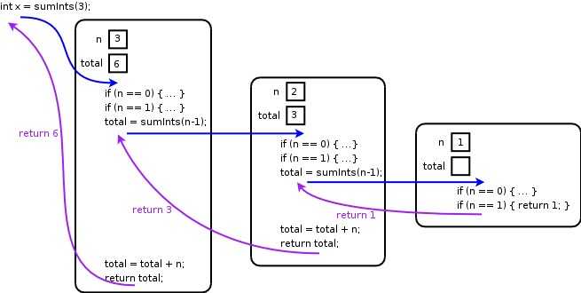

We have seen one mechanism for expression repetition in Java: loops (such as while loops and for loops).

*Recursion* is another technique for expression repetition that works by having a method *call itself*.  This may seem strange, but recursion is a very powerful technique that yields simple and elegant solutions to many kinds of problems.

How Recursion Works
-------------------

Recursion works by dividing a large problem into one or more smaller problems, and then extending the solution to the smaller problem(s) into a solution for the large problem.  For this approach to work, three properties need to hold:

1.  The smaller problem(s), or *subproblem(s)*, must have the same form as the larger problem.  Subproblems are solved *recursively*, by making another call to the same method using different parameter values.
2.  There must be one or more instances of the problem that can be solved *without* recursion: these are known as the *base cases*.
3.  All recursive calls must *make progress* towards a base case, so that the computation will eventually complete.

Example
-------

As an example, consider the problem of computing the sum of the integers in the sequence 1..*n*.  We can observe that the overall sequence

> 1 + 2 + 3 + 4 + ... + *n*-1 + *n*

can be expressed as the sum of the integers 1..*n*-1 plus *n*:

> (1 + 2 + 3 + 4 + ... + *n-1*) + *n*

Looking at the problem this way, the sum of the sequence 1..*n*-1 is a *subproblem* that helps us solve the overall problem: all we need to do is add the value of *n* to the solution to the subproblem, and we have solved the entire problem.

We need to identify one or more *base cases* that will eventually be reached.  Two easy cases occur when *n*=0 and *n*=1: the sums are 0 and 1 respectively.  This leads us to a recursive method to solve the problem.  (We will assume that this method will only be called with nonnegative values of the parameter **n**.)


public static int sumInts(int n) {
  // Check base cases
  if (n == 0) { return 0; }
  if (n == 1) { return 1; }

  // Solve subproblem, add n, and we're done
  int total = sumInts(n - 1);
  total = total + n;
  return total;
}


To understand what's happening, consider how each recursive call to **sumInts** is "expanded" when we use the method to compute the sum 1..4

<pre>
sumInts(4) = sumInts(3) + 4
           = (sumInts(2) + 3) + 4
           = ((sumInts(1) + 2) + 3) + 4
           = ((1 + 2) + 3) + 4
           = 10
</pre>

The sequence of recursive calls works on smaller and smaller subproblems until it reaches a base case.  As each subproblem is solved, the overall solution is built up by adding **n** at each step.

Recursion and the Call Stack
----------------------------

So, how do recursive calls work?  It seems strange that more than one call to a method may be in progress at the same time.

The way that method calls are implemented in Java, and in most other programming languages, is using a data structure known as the *call stack*.  The call stack consists of *activation records* for each method call.  Each activation record contains the values of the parameters and local variables for one method call.

Here is a picture showing the activation records created while evaluating the statement `int x = sumInts(3);`

> 

The rounded boxes are the activation records.  Each time a method is called (shown by the blue arrows), a new activation record is created to store the values of the parameter **n** and the local variable **total**.  The statements in each method are executed within the context of the activation record: if one of the statements is a method call, then a new activation record is created.  When a return statement is executed, then the method returns.  Since the **sumInts** method returns an **int** value, the return conveys a value back to the caller.  Returns are shown by the purple arrows.  When a method returns, the current activation record is no longer needed.

When a method is called, we say that the call stack has gotten *deeper*.  When a method returns, its activation record is no longer needed, and we return *up* the call stack.  The **main** method where execution of the program begins is the "top-most" activation record on the call stack.

Tail Recursion
--------------

A method is *tail recursive* if the return value of each recursive call in the method is immediately returned.  In other words, no work remains to be done after the recursive call(s).  Tail recursive methods can be executed more efficiently in some programming languages because at the point where the recursive call is made, the current activation record is no longer needed, and its memory can be immediately reclaimed.  (This technique is especially important in functional programming languages like Scheme.)

The **sumInts** method is *not* tail recursive because after the recursive call returns, the method still needs to add the value of **n** to the total.

Recursive methods can generally be rewritten to make them tail recursive.  The critical step is that the partial result computed so far needs to be passed to each recursive call as a parameter: this is done using an *accumulator parameter*.

Because of the need to use an accumulator parameter, you will generally need to have two methods: the "front-end" method, and the "worker" method that actually performs the computation.  The front-end method's only purpose is to kick off the computation and pass an initial value for the accumulator parameter.  The initial accumulator value should be whatever value is appropriate to represent that (initially) no work has been done.  The worker method should be declared as private, since it will only be called by the front-end method.

Here is a version of the **sumInts** method using an accumulator parameter:


public static int sumInts(int n) {
  return sumIntsWork(n, 0);
}

private static int sumIntsWork(int n, int accum) {
  if (n == 0) { return accum; }
  if (n == 1) { return accum + 1; }
  accum = accum + n;
  return sumIntsWork(n - 1, accum);
}


Notice how the addition of **n** to the accumulator is done *before* the recursive call.  This avoids the need to do any work *after* the recursive call has returned.

Here is how the calls "expand" in this version when calculating the sum of the ints 1..4:

<pre>
sumInts(4) = sumIntsWork(4, 0)
           = sumIntsWork(3, 4)
           = sumIntsWork(2, 7)
           = sumIntsWork(1, 9)
           = 10
</pre>

Notice how each call expands directly into another call without requiring an extra addition term.  The base case is reached when **n** equals 1, at which point we add 1 to the accumulator value and the computation completes.

More Examples
-------------

Here are some more examples of recursive methods.


// Compute factorial recurively
// The factorial of N, written "N!", equals 1 * 2 * ... * N-1 * N
// Assume that n >= 0
public static int fact(int n) {
  if (n == 1) { return 1; }
  return fact(n - 1) * n;
}

// Tail-recursive version of computing factorial
public static int factTailRec(int n) {
  return factTailRecWork(n, 1);
}

public static int factTailRecWork(int n, int accum) {
  if (n == 1) { return accum; }
  accum = accum * n;
  return factTailRecWork(n - 1, accum);
}

// Recursively count the number of "3" digits in an int value.
// The approach is to treat 0 as the base case (containing 0 "3" digits).
// The recursive case determines whether or not the last digit is
// a "3" and recursively computing the number of "3" digits in the
// int value consisting of all digits *except* the last digit.
public static int countThrees(int n) {
  if (n == 0) { return 0; }
  int lastDigit = n % 10;
  int total = 0;
  total = total + countThrees(n / 10);
  if (lastDigit == 3) {
    total = total + 1;
  }
  return total;
}

// Tail-recursive version of countThrees
public static int countThreesTailRec(int n) {
  return countThreesTailRecWork(n, 0);
}

private static int countThreesTailRecWork(int n, int accum) {
  if (n == 0) { return accum; }
  int lastDigit = n % 10;
  if (lastDigit == 3) {
    accum = accum + 1;
  }
  return countThreesTailRecWork(n / 10, accum);
}

