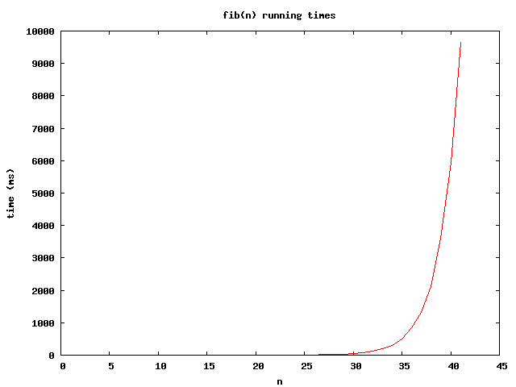

The [Fibonacci Sequence](http://en.wikipedia.org/wiki/Fibonacci_sequence) may be defined recursively by the following formula:

> f(0) = 0
>
> f(1) = 1
>
> f(n) = f(n-2) + f(n-1)    *for n&gt;1*

This leads to a very simple recursive implementation of a method to compute the *n*'th member of the Fibonacci sequence:


public static int fib(int n) {
    if (n < 0) throw new IllegalArgumentException();
    if (n == 0 || n == 1)
        return n;
    return fib(n - 2) + fib(n - 1);
}


This method is *correct*, in the sense that it will compute the correct result.  However, it is not *efficient* because it violates one of the rules of recursion: specifically, it recomputes the answer to subproblems more than once.

Here is the "tree" of recursive calls that will result from calling the **fib** method with the argument 5:

> 

Note that the subproblem fib(3) is computed twice, fib(2) is computed three times, fib(1) is computed 5 times, and fib(0) is computed 3 times.  As n increases, the size of the tree (the number of recursive calls required) grows *exponentially*.  Exponential functions grow very, very fast; so fast that algorithms with exponential running time are generally intractable, even for relatively small input sizes.  In an algorithm with exponential running time, even a small input may require a very large number of steps to solve.

Here is a Java program that computes members of the Fibonacci sequence recursively using the naive approach:


public class Fib {
  public static void main(String[] args) {
    int n = Integer.parseInt(args[0]);
    long begin = System.currentTimeMillis();
    int result = fib(n);
    long end = System.currentTimeMillis();
    System.out.println("fib("+n+")=" + fib(n) + "[" + (end-begin) + " ms]");
  }

  public static int fib(int n) {
    if (n == 0 || n == 1)
      return n;
    else
      return fib(n-2) + fib(n-1);
  }
}


If you try running this program, you will notice that the number of milliseconds required to compute the requested Fibonacci number grows very quickly.  On my laptop&dagger;, the 40th Fibonacci number takes about 6 seconds to compute, and the 41st takes 9.5 seconds!  Here is a graph showing the number of milliseconds required for n=1 to n=41:

> 

&dagger; This was written in 2005.  A more recent computer would be faster, but the shape of the plot's curve would be similar.

Obviously, this is not a good implementation of **fib**.

*Memoization* is a technique for avoiding recomputing the answers to subproblems in a recursive algorithm.  The idea is very simple: record the answers to subproblems in a table.  Each time an answer to a subproblem is needed, consult the table.  If no answer exists in the table, perform the computation *and save the answer in the table*.  Future occurrences of the subproblem can be "solved" by just loading the answer from the table.

Here is a simple memoized version of the same program.  Answers to subproblems are saved in an array called **memo**.


public class FibMemo {
  public static void main(String[] args) {
    int n = Integer.parseInt(args[0]);
    long begin = System.currentTimeMillis();
    int result = fib(n);
    long end = System.currentTimeMillis();
    System.out.println("fib("+n+")=" + fib(n) + "[" + (end-begin) + " ms]");
  }

  public static int fib(int n) {
    return fibMemo(n, new int[n + 1]);
  }

  public static int fibMemo(int n, int[] memo) {
    if (n == 0 || n == 1)
      return n;

    int answer = memo[n];
    if (answer == 0) {
      answer = fibMemo(n-2, memo) + fibMemo(n-1, memo);
      memo[n] = answer;
    }

    return answer;
  }
}


Because each subproblem is computed only once, this version of **fib** has linear (O(n)) running time.  As you can see, this memoized implementation is a trivial modification of the naive recursive implementation.

A related technique, called *dynamic programming*, is to start with the smallest subproblem, and then to iteratively work up towards larger problems, until the overall problem is solved.  This kind of solution can be written using a loop of the general form

<pre>
for j = 1 to n
    memo[j] = solve subproblem j

return memo[n]
</pre>

The step that reads "solve subproblem j" may be implemented by looking up the answers to previously solved subproblems.

Here is a dynamic programming version of the program to compute the *n*'th Fibonacci number:


public class FibDynamic {
  public static void main(String[] args) {
    int n = Integer.parseInt(args[0]);
    long begin = System.currentTimeMillis();
    int result = fib(n);
    long end = System.currentTimeMillis();
    System.out.println("fib("+n+")=" + fib(n) + "[" + (end-begin) + " ms]");
  }

  public static int fib(int n) {
    int[] memo = new int[n+1];
    memo[0] = 0;
    memo[1] = 1;
    for (int i = 2; i <= n; i++) {
      memo[i] = memo[i-2] + memo[i-1];
    }
    return memo[n];
  }
}

