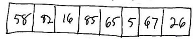
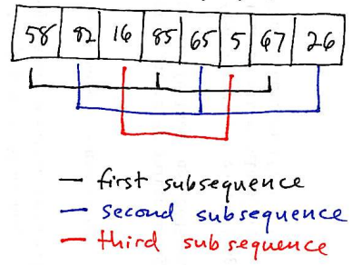
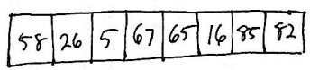

Sorting demo application: [SortDemo.zip](SortDemo.zip) (Eclipse project, import using **Import&rarr;Existing Projects into Workspace**)

Sorting
=======

*Sorting* is a general term to describe a process that takes a sequence (list) of values, and puts them in order, either ascending (lowest to highest) or descending (highest to lowest).

Typically, an implementation of a sorting algorithm will sort the values in place within a data structure such as an array or **ArrayList**, where it is possible to get and set values at an arbitrary position (index) in the sequence in O(1) time. The reason we need O(1) get and set operations is because most sorting algorithms work by *swapping* pairs of values in the sequence.

However, we will (eventually) see one sorting algorithm that works efficiently even for linked lists.

Insertion Sort
==============

*Insertion sort* is a simple sorting algorithm. Here's an implementation:


public static<E extends Comparable<E>> void insertionSort(E[] arr) {
    for (int j = 1; j < arr.length; j++) {
        for (int i = j; i > 0; i--) {
            if (arr[i - 1].compareTo(arr[i]) <= 0) {
                break;
            }
            swap(arr, i - 1, i);
        }
    }
}


The important invariant in the algorithm is that at all times, all elements of the array with index values less than **j** are sorted: element 0 is less than element 1, element 1 is less than element 2, etc. Trivally, when the method starts and **j** is 1, the invariant is true because any sequence containing exactly one element is, by definition, already sorted.

The algorithm works by moving an index **j** from index 1 forward to the end of the array. Each time the body of the outer loop starts, the element at index **j** is a value that we want to *insert* into its correct overall position. The insertion is accomplished by the inner loop. An index **i** starts at **j** and works backwards towards the beginning of the array. Each time the inner loop finds that the element at **i**-1 is greater than the element at **i**, those values are swapped and the loop continues. Otherwise, the loop terminates, because the inserted value is already in the correct position.

The **swap** method swaps the values at two given indices in an array:


public static<E> void swap(E[] arr, int i, int j) {
    E tmp = arr[i];
    arr[i] = arr[j];
    arr[j] = tmp;
}


Analysis
--------

The outer loop always executes O(N) times. In the worst case, the inner loop executes **j** - 1 iterations. So, overall, the algorithm is O(N2). This worst case occurs when the array is initially in reverse order: this forces the inner loop to do the maximum amount of work when inserting each element.

The average case is also O(N2). Because the array is initially unsorted, each inserted element is equally likely to be placed at any index less than **j**, so the average amount of work needed to insert an element is **j**/2.

Shell Sort
==========

An interesting property of Insertion Sort is observed when the input array is already sorted. In this case, the algorithm is O(N), because the inner loop always performs exactly one iteration before terminating. This property of Insertion Sort leads to a variation of Insertion Sort called [Shell Sort](http://en.wikipedia.org/wiki/Shell_sort) (named after its inventor, Donald Shell.)

Shell Sort works as follows. An initial *gap* is chosen. The gap value is an integer which is half the number of elements, or less. The algorithm uses insertion sort to sort each subsequence separated by *gap* number of elements.

For example: let's say that we're sorting the following array of length 8:

> 

Also, let's say that the initial gap is 3. There are 3 specific subsequences in which each element is separated by a gap of 3 elements:

> 

After sorting each of these subsequences using Insertion Sort, the contents of the array are:

> 

Note that the overall sequence is closer to being in sorted order than it was originally.

Here is the overall Shell Sort algorithm (in pseudo-code):

    gap = chooseInitialGap()

    while (gap > 0) {
        for (k = 0; k < gap; k++) {
            insertion sort subsequence starting at k, skipping every gap # of elements
        }
        gap = chooseNextGap(gap)
    }

Note that we have not specified how the initial gap is chosen, and we have not specified how the gap changes as the algorithm proceeds.

The initial gap should be large, so that elements can move relatively far in the array. Dividing the number of array elements by 2 yields a good initial gap size.

To change the gap, the gap should be divided by a constant, so that the gap decreases exponentially. Experiements have shown that dividing by 2.2 yields good results. Note that the final gap size must be 1: that way, Shell Sort ends by doing a normal insertion sort. However, because the array will be almost sorted, this will be fast.

Analysis
--------

The performance of Shell Sort depends on the sequence of gap values used. A bound of O(N log2 N) can be achieved with a careful chosen gap sequence. This is not optimal, but is still much better than the O(N2) bound for Insertion Sort.
