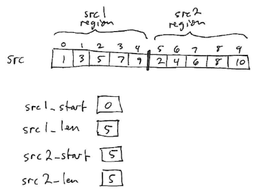
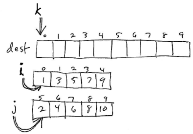
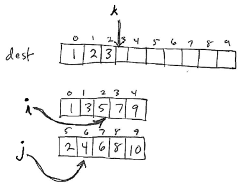
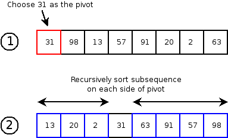
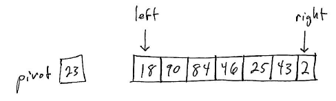

Last time we looked at [Insertion Sort](lecture23.html) a simple sorting algorithm which is O(N2) in both the worst case and the average case.  We also looked at Shell Sort, an efficient variation of Insertion Sort.

Today we'll look at two *optimal* sorting algorithms:

-   Merge Sort, which is O(N log N) in the worst case.
-   Quick Sort, which is O(N log N) in the average case, but O(N2) in the worst case. However, we can make the worst case unlikely to occur.

These algorithms are *optimal* because O(N log N) is the best asymptotic upper bound that it is possible to achieve for sorting.

Merge Sort
==========

If we have two sequences of elements which are already sorted, we can *merge* them to produce a single sorted sequence containing both sequences of elements in O(N) time, where N is the total number of elements in the two sequences being merged.

Implementation:


private static<E extends Comparable<E>>
void merge(
        E[] dest,
        int dest_start,
        E[] src,
        int src1_start,
        int src1_len,
        int src2_start,
        int src2_len) {
    int k = dest_start, i = src1_start, j = src2_start;

    while (i < src1_len+src1_start || j < src2_start+src2_len) {
        if (i >= src1_start+src1_len) {
            dest[k] = src[j];
            j++;
        } else if (j >= src2_start+src2_len) {
            dest[k] = src[i];
            i++;
        } else if (src[i].compareTo(src[j]) < 0) {
            dest[k] = src[i];
            i++;
        } else {
            dest[k] = src[j];
            j++;
        }
        k++;
    }
}


Note that the **merge** method shown merges two "chunks" of a source array --- the region from src1\_start to (src1\_start+src1\_len)-1 and the region from src2\_start to (src2\_start+src2\_len)-1.

For example:

> 

The merged sequence of elements will be placed in a region of the destination array starting at dest\_start.

The merge algorithm has three loop variables: i, j, and k. k refers to the element where the next merged value will be placed in the destination array. i and j refer to elements in the the src1 and src2 regions of the source array.

The algorithm works by initially setting the variable k to dest\_start (the beginning of the region of the destination array where the merged sequence should be stored), the variables i and j index values at the beginning of the regions in the source array to be merged:

> 

On each iteration of the loop, the algorithm looks at the values at i and j. Whichever is the smallest is placed in the merged region, and the appropriate index variable (i or j) is incremented. Special cases arise when one of the two source regions no longer contains any elements.

Here is how the example presented above would look after 3 iterations of the loop:

> 

3 elements from the src1 and src2 regions have been copied into the destination region.

Once we have defined the merge operation, merge sort is a very simple algorithm. It works using a temporary array (or array list) the same size as the overall array being sorted. The algorithm is defined recursively:

1.  If the region being sorted has less than 2 elements, do nothing. Otherwise:
2.  Divide the overall region into two halves.
3.  Merge sort the left region.
4.  Merge sort the right region.
5.  Merge the contents of the left and right regions (which are now sorted) into a region of the temporary array.
6.  Copy the (sorted) elements in the temporary array back to the array being sorted.

Because the algorithm works by dividing the overall problem into (roughly) equal-size chunks, it is a *divide and conquer* algorithm.

In code:


private static<E extends Comparable<E>>
void mergeSortWork(E[] arr, int start, int len, E[] temp) {
    if (len < 2) {
        return;
    }
    mergeSortWork(arr, start, len/2, temp);
    mergeSortWork(arr, start + (len/2), len - (len/2), temp);
    merge(temp, start, arr, start, len/2, start + (len/2), len - (len/2));
    for (int i = start; i < start + len; i++) {
        arr[i] = temp[i];
    }
}

public static<E extends Comparable<E>>
void mergeSort(E[] arr) {
    mergeSortWork(arr, 0, arr.length, (E[]) new Comparable[arr.length]);
}


Analysis
--------

The O(N log N) worst case upper bound on merge sort stems from the fact that merge is O(N).

Consider the "tree" of recursive calls that is required to merge sort a sequence containing N elements. The root of the tree, which is the top-level call, needs to merge N elements. The second level of the tree, which recursively sorts the two halves of the overall sequence, needs to merge N/2 elements twice (once for each half). The third level of the tree, which recursively sorts the four quarters of the overall sequence, needs to merge N/4 elements four times (once for each quarter). In general, the amount of work done at each level of the tree is O(N).

The overall tree of recursive calls will have log2 N levels. This is because if you start at any integer N, and repeatedly divide by 2, you will reach a value &le; 1 in log2 N steps. Since the base case of the algorithm occurs when N is &le; 1, that is how many levels the tree of recursive calls will have.

Thus, the overall amount of work done is O(N log N).

One disadvantage of Merge Sort is the need for the temporary array to store the merged elements, which requires O(N) space.

Interesting Fact
----------------

We can also define a variation of the merge algorithm that can merge chains of linked list nodes in O(N) time. So, it is possible to merge sort the elements of a linked list in O(N log N) time.

Quick Sort
==========

Quick sort is another divide-and-conquer sorting algorithm based on the partition operation. For each array region to be sorted using quick sort, a pivot element is selected. (The pivot can be any element of the region.) The region is arranged so that all elements less than the pivot are placed before the pivot, and all elements greater than the pivot are after the pivot. This can be done in O(N) time for N elements. After partitioning, the region on each side of the pivot is sorted recursively.

Here is an example of a single step in executing quicksort:

> 

Analysis
--------

If the choice of pivot always results in equal-sized (or close to equal-sized) partitions before and after the pivot, then quick sort will run in O(N log N) time. (The argument is the same as for Merge Sort.)

Unfortunately, there is no way to guarantee that the pivot will result in this outcome, unless we sort the entire sequence! Choosing a bad pivot---either the min or max element in the region being sorted---would result in subproblems of size 0 and size N-1. If a bad pivot is chosen at every step, then the total running time will be O(N2). (The problem is that we are only eliminating one element, the pivot, at each step!)

One way to address the problem of pivot selection is to sample a small number of elements from the region, and choose the median element as the pivot. While this does not guarantee that the pivot will result in equal sized subproblems, it makes it extremely unlikely that the subproblems will differ greatly in size. For this reason, the expected (average) case running time of quick sort is O(N log N).

Implementation
--------------

The main difficulty in implementing Quick Sort is the partition operation. The idea is to start two index variables (left and right) at either end of the region being paritioned:

> 

The goal is that all elements in the left partition have values &le; than the pivot value, and all elements in the right partition have values &gt; the pivot value.

At each step, look at the left and right elements. If the element at the left index should be part of the left partition, increment it and continue. If the element at the right index should be part of the right partition, decrement it and continue. If neither the left nor right element is in the correct place, swap them and continue.

The algorithm terminates when the left index is greater than the right. At that point, the left index will refer to the leftmost element of the right partition.

One subtlety is what to do with pivot element itself. The textbook suggests moving it to the end of the region initially, and then swapping it with the left index when the loop terminates. This works well: the pivot will be be left in the correct place.

Here's a possible implementation of the partition algorithm:


private static<E extends Comparable<E>>
int partition(E[] arr, int start, int len) {
    // As the pivot, choose the middle element of the sequence
    int pivotIndex = start  + (len/2);
    E pivotVal = arr[pivotIndex];

    // Stash the pivot at the end of the region we're partitioning
    swap(arr, pivotIndex, start + (len - 1));

    // Partition all of the elements,
    // based on their order with respect to the pivot value.
    int left = start;
    int right = start + (len - 2);

    // Goal:
    // - all elements less than the pivot are in the left partition
    // - all elements greater than or equal to the pivot are in the right partition
    while (left <= right) {
        if (arr[left].compareTo(pivotVal) < 0) {
            left++;
            continue;
        }
        if (arr[right].compareTo(pivotVal) >= 0) {
            right--;
            continue;
        }
        // Both elements are in the wrong place,
        // so swap them.
        swap(arr, left, right);
    }

    // The left index should now be positioned at
    // the first element in the right partition.
    // Swap it with the stashed pivot value.
    swap(arr, left, start + (len-1));

    return left;
}


Once we have the partition algorithm implemented, implementing Quick Sort is easy:


private static<E extends Comparable<E>>
void quickSortWork(E[] arr, int start, int len) {
    if (len < 2) {
        return;
    }
    int mid = partition(arr, start, len);
    quickSortWork(arr, start, mid - start);
    quickSortWork(arr, mid+1, (start+len) - mid - 1);
}

public static<E extends Comparable<E>>
void quickSort(E[] arr) {
    quickSortWork(arr, 0, arr.length);
}

