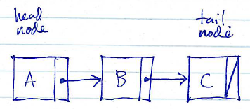
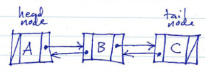

Background
==========

A linked list is a concrete data structure which models a sequence.

A linked list is a chain of *node* objects. Each node object stores

-   A single value in the sequence; this is the *payload*
-   A reference (pointer) to the node storing the next value in the sequence; this is the *successor* reference.

Optionally, a node may also have a reference to the node containing the previous value in the sequence. This is the *predecessor* reference.

Linked lists whose nodes contain only successor references are known as *singly-linked*. Linked lists containing both successor and predecessor references are known as *doubly-linked*.

The *head* of a linked list is the node containing the first element of the sequence. The *tail* of a linked list is the node containing the last element of the sequence.

Here are two diagrams showing linked lists (chains of nodes) containing the sequence *A*, *B*, *C*:

> Singly-linked list:
>
> 
>
> Doubly-linked list:
>
> 

Characteristics
===============

Linked lists have the following general characteristics

-   O(1) prepend and append operations
-   O(1) remove first element
-   O(1) remove last element for doubly-linked lists; O(N) for singly-linked lists
-   O(N) get/set/insert/remove using an arbitrary index
-   O(1) insert/remove given a pointer to a list node which is adjacent to the insertion and/or removal site
-   O(N) to iterate through values from beginning of sequence to end
-   O(N) to iterate backwards through values (end to beginning) for doubly-linked lists only

Because the operations that get and set elements at an arbitrary index take O(N) time, linked lists can be said to support a *sequential* access for elements. Algorithms that require *random* access to elements in the sequence should use an array-based sequence data structure which supports get and set at an index in O(1) time.

The most interesting characteristic of linked lists is their ability to add and remove elements in O(1) time at both ends, and their ability to perform O(1) element insertions and removals given a reference to a list node adjacent to the insertion/removal site.

Implementation issues
=====================

Linked lists can be somewhat tricky to implement correctly.

The key to correctly implementing operations on a linked list is to preserve the fundamental *invariants* of the data structure:

-   The linked list must keep track of which node contains the first and last values in the sequence
-   For a node *N* in the chain containing a value *V* in the sequence, *N*'s successor reference must point to the node containing the successor to *V* in the sequence
-   Doubly-linked lists: For a node *N* in the chain containing a value *V* in the sequence, *N*'s predecessor reference must point to the node containing the predecessor to *V* in the sequence

When implementing a linked list, you will need to be very careful to preserve these invariants. Often, special cases will emerge, especially when performing operations at the head and tail (beginning and end) of the chain of nodes.

Termination
-----------

The first and last values in a sequence are special cases: the first value has no predecessor, and the last value has no successor. A linked list implementation will need to use some form of *termination* for the nodes storing the first and last values in the sequence.

There are two common strategies:

**(1)** Use **null** as a terminator. In this strategy, the head node's predecessor reference is the **null** value, and the tail node's sucessor reference is the **null** value.

> Doubly-linked list terminated by null:
>
> 

When the chain of nodes is terminated using **null**, the methods which implement the linked list operations must be very careful to check successors and predecessors to ensure that they are non-null before attempting to use them (by accessing the payload, following successor/predecessor links, etc.)

**(2)** Use *sentinel nodes*. A sentinel node is a special node which does not contain an element of the sequence.

Sentinel nodes are useful to eliminate some (all?) special cases that would otherwise arise when performing operations at the beginning and end of the linked list. For example, if the head node is preceeded by a sentinel node, and the tail node is followed by a sentinel node, then all of the nodes in the list which contain element values have predecessor and successor nodes. This can significantly reduce the complexity of implementing the linked list operations.

> Doubly-linked list terminated by sentinel nodes:
>
> 

Using sentinel nodes in a linked list creates a new invariant: the "head sentinel" must always be the predecessor of the head node, and the "tail sentinel" must always be the successor of the tail node.
