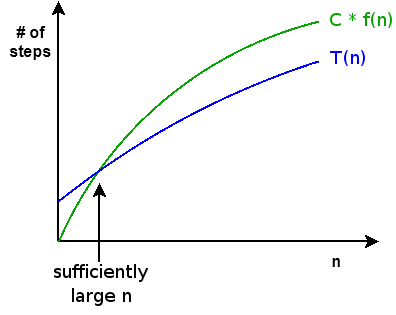

Copyright (C) 2005-2008, [David H. Hovemeyer](http://faculty.ycp.edu/%7Edhovemey/)

 This work is licensed under a [Creative Commons Attribution-Noncommercial-Share Alike 3.0 United States License](http://creativecommons.org/licenses/by-nc-sa/3.0/us/).

*Algorithm analysis* refers to examining an algorithm and determining, as a function of the size of its input, how many steps the algorithm will take to complete.

General rules:

1.  a program statement that is not a method call: 1 step

2.  loop executing *n* iterations: *n* \* *m*, where *m* is the cost of a single loop iteration (**NOTE**: *m* may be a function of which loop iteration is being executed)

3.  method call: however many steps the method body will take given the arguments passed to the method

Usually, we are interested in the *worst case*: the absolute upper limit for how many steps the algorithm will take.  Sometimes we may be interested in the *average case*, although what consistitutes the *average* case can be difficult to define and complicated to analyze.  The worst case is usually fairly easy to figure out, and algorithms with good worst case behavior give us confidence that our program will run efficiently no matter what input we give it.

A simple example: a linear search for an array element matching a specified value:


public static<E> int findElement(E[] array, E element) {
    for (int i = 0; i < array.length; i++) {
        if (array[i].equals(element))
            return i;
    }
    return -1;
}


In the worst case (the array doesn't contain the element we're looking for), the loop will execute once for each element of the array.  Each loop iteration executes 1 statement (the if).  So, the worst case running time of this algorithm is

> *N* + 1

where *N* is the length of the array.  (We tacked on an extra step for the return statement at the end.)

A more complicated case: finding out whether or not an array contains duplicate elements:


public static<E> boolean containsDuplicates(E[] array) {
    for (int i = 0; i < array.length; i++) {
        E element = array[i];
        for (int j = i + 1; j < array.length; j++) {
            E other = array[j];
            if (element.equals(other))
                return true;
        }
    }
    return false;
}


This algorithm is harder to analysis because the number of iterations of the inner loop is determined by which iteration of the outer loop is executing.

It is clear that the in the worst case, the outer loop will execute once for each element of the array.  The inner loop executes once for each element of the array past element *i*.  We'll say that the inner loop executes two statements, and that one statement executes before the inner loop (element = array[i]).  So, as a series, the number of steps performed by the nested loops together is something like:

> = (1 + 2(*N*-1)) + (1 + 2(*N*-2)) + ... + (1 + 2(1)) + (1 + 2(0))
>  = *N* + 2(*N* \* (*N*/2))
>  = *N* + *N*2

(Recall that the sum of the series 1 + 2 + ... + *N*-2 + *N*-1 is *N*\**N*/2.)

Tacking on an extra step for the final return statement and putting the terms in canonical order, we get a worst case cost of

> *N*2 + *N* + 1

where *N* is the length of the array.

Big-O
-----

In analyzing an algorithm, we are generally interested in its *growth* as *N* increases, rather than an exact number of steps.  *Big-O* refers to characterizing the growth of the exact cost T(n) of an algorithm in relation to a simpler function f(n).  Specifically, the exact cost T(n) of an algorithm is O(f(n)) iff

> There exists some constant *C* such that *C* \* f(n) \>= T(n) for all sufficiently large values of n

Visually, f(n) is an upper bound for T(n) once we reach some sufficiently large value of n:

> 

Finding the big-O bound for an algorithm is really easy, once you know its exact cost:

-   Discard all terms except for the *high order* term
-   Discard all constants

You can find the high order term according to the following inequalities (assume k \> 1, j \> k):

> 1 \< log n \< n1/k \< n \< nk \< nj \< kn

So, our algorithm to search an array for a specified element is O(N), and the algorithm to determine whether or not an array has duplicate elements is O(N2).  In the second case, we had both *N* and *N*2 terms, but *N*2 dominates *N*.

Playing fast and loose
----------------------

One of the nice things about analysis using big-O is that you can *immediately* drop low order terms.  For example, it is perfectly valid to say things like:

> That inner loop is O(N2), and it executes in an outer loop that is O(N).  So, the entire algorithm is O(N3).
