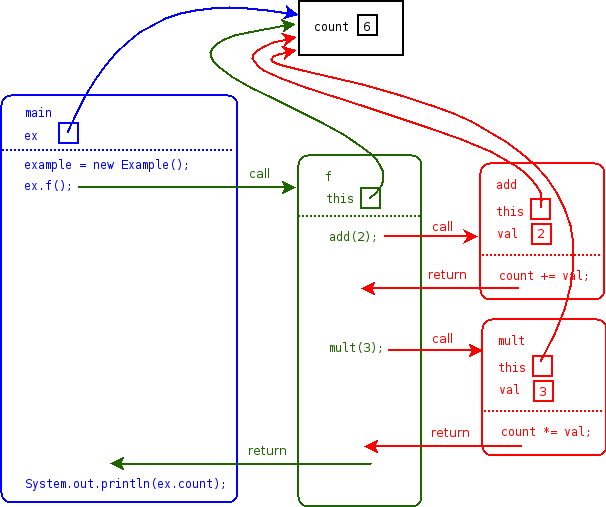
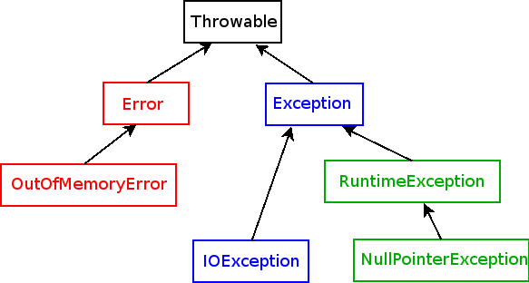
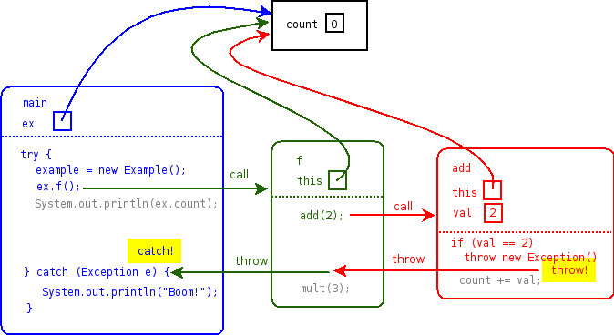

# Basic Input and Output

Java provides a number of classes for input and output.  They are defined in the **java.io** package.

The InputStream and OutputStream classes, and their subclasses, perform input and output on bytes.  The Reader and Writer classes, and their subclasses, perform input and output on characters---in other words, text.  So, Reader and Writer objects are generally what you will want to use for human-readable input and output.

The InputStreamReader and OutputStreamWriter classes allow you to take an InputStream or OutputStream, and use it as a Reader or Writer, respectively.

The BufferedReader class is a particularly useful kind of Reader, because it allows you to read entire lines of input at a time.

Here is a complete example using a BufferedReader to read each line of input from the **System.in** object (which is an InputStream), and then print them out to **System.out**:


package edu.ycp.cs201;

import java.io.BufferedReader;
import java.io.InputStreamReader;
import java.io.IOException;

public class ReaderDemo {
    public static void main(String[] args) throws IOException {
        BufferedReader reader = new BufferedReader(
            new InputStreamReader(System.in));
        while (true) {
            String line = reader.readLine();
            if (line == null) {
                break;
            }
            System.out.println(line);
        }
    }
}


# StringTokenizer

The **java.util.StringTokenizer** class is useful for breaking up a String into *tokens*.  Usually, the tokens are chunks of non-space characters---i.e., words---separated by space characters.  Here is an example:


package edu.ycp.cs201;

import java.util.StringTokenizer;

public class StringTokenizerDemo {
    public static void main(String[] args) {
        String s = "Hello CS 201";
        StringTokenizer tokenizer = new StringTokenizer(s);
        while (tokenizer.hasMoreTokens()) {
            String token = tokenizer.nextToken();
            System.out.println(token);
        }
    }
}


This program will print the lines

    HelloCS201

# Exceptions

An *exception* in Java is a special kind of object that represents an "exceptional" situation, where the current computation cannot proceed for some reason.  For example, many of the methods that perform input or output are defined to throw **IOException**.  An IOException might mean that the file you are reading from is corrupted.

In Java, exceptions must be dealt with in one of two ways.

1.  First, you can add a *throws clause* to the method you are writing, where an exception might be thrown.  This means that if a particular exception can arise inside the method, or in any other method called by the method, then the exception is allowed to be thrown out of the method.

2.  Second, you can write an *exception handler*.  An exception handler specifies some code that recovers from the exception, and potentially allows the program to continue executing.

In general, adding a throws clause is the best approach to dealing with possible exceptions.  For example, if you look carefully at the definition of the ReaderDemo class above, you will note that its **main** method has been defined to throw **IOException**.  This is because BufferedReader's **readLine** method can throw IOException.

## Handling exceptions

However, sometimes you will want to handle an exception.  Let's say we wanted to rewrite ReaderDemo so that it actually handles any IOException that might be thrown.  We do so by adding a *try/catch* block:


package edu.ycp.cs201;

import java.io.BufferedReader;
import java.io.InputStreamReader;
import java.io.IOException;

public class ReaderDemo {
    public static void main(String[] args) {
        BufferedReader reader = new BufferedReader(
            new InputStreamReader(System.in));
        try {
            while (true) {
                String line = reader.readLine();
                    if (line == null) {
                        break;
                }
                System.out.println(line);
            }
        } catch (IOException e) {
            System.err.println("Caught an IOException!");
        }
    }
}


The general form of a try/catch block is this:


try {
    // code that can throw an exception
} catch (ExceptionType e) {
    // code that handles ExceptionType
} catch (AnotherExceptionType e) {
    // code that handles AnotherExceptionType
}


Multiple catch blocks can be added to catch whatever types of exceptions are thrown by the code in the *try* block.

## Finally

Finally blocks may be used in addition to or in place of catch blocks (but in any case, the finally block must come *after* any catch blocks).  The code in a finally block is *always* executed following the execution of the *try* block, even if an exception is thrown from the try block.  Finally blocks are often used to run *cleanup* code.

## The call stack

In order to understand what happens when an exception is thrown we first need to fully examine how method calls are handled when the program is executed.  Each call to a method creates a new *stack frame*; the stack frame holds the values of each local variable in the method, as well as the location in the code where the method was called from.

Here is a very simple Java program:


public class Example {
    private int count = 0;

    public static void main(String[] argv) {
        Example ex = new Example();
        ex.f();
        System.out.println(ex.count);
    }

    public void f() {
        add(2);
        add(3);
    }

    public void add(int val) {
        count += val;
    }

    public void mult(int val) {
        count *= val;
    }
}


We will represent each stack frame as a box showing the current values of each local variable.  Calls to other methods will be represented as arrows originating at the location of the call and pointing to the stack frame of the called method.

Note that the values of method parameters, and the special **this** value are also considered to be local variables.  We make this generalization because both parameters and **this** are values that are specific to a particular method call (and its stack frame).

Here is the stack frame representation of the program above:

> 

The colored boxes with rounded corners are stack frames.  The reason the call stack is called a stack is because when a method is called, its stack frame is *pushed* onto the call stack, and when a method returns, its stack frame is *popped* off of the call stack.  We will examine the stack data structure in more detail in a future lecture.

Try tracing through the diagram to convince yourself that the arrows representing method calls and returns correctly represent the way the program will execute.  A method call creates a new stack frame and starts executing the called method within that stack frame.  A method return leaves the current stack frame and returns to the location just after the place where the method was called originally, within the context of the previous stack frame.

## Exception Classes

In Java, an *exception* is an ordinary object that is *thrown* when an error prevents the program from continuing.  Exceptions are ordinary Java objects that are subclasses of the **java.lang.Throwable** class.  The following inheritance diagram shows how the various exception classes are organized:

> 

**Error** and subclasses of Error represent very serious error conditions, such as running out of memory.  In general, you will not need to be concerned with Errors.

**RuntimeException** and subclasses signify bugs in the program.  For example, trying to call a method through a reference that is **null** results in a **NullPointerException**.  Another example is trying to access an array element that is either less than 0, or greater than or equal to the length of the array, which results in a **ArrayIndexOutOfBoundsException**.  These errors are not as serious as those that are subclasses of **Error**, and in some situations it may be appropriate to handle runtime exceptions.  However, a better approach is to fix the bug that is causing the runtime exception to be thrown.

**Exception**, and all of its subclasses (except **RuntimeException** and its subclasses) represent errors that are generally recoverable.  These exceptions are known as *checked exceptions* because in order for these exceptions to be thrown from a method, the method must declare them.  (We will see what that means shortly.)  One of the most common checked exceptions is **IOException**, which can occur when opening or closing a file, or reading or writing data using a stream, reader, or writer object.

## How Exceptions Work

There are three general ways that an exception can be thrown in some block of code:

1.  The block of code called a method which threw an exception
2.  One of the statements in the block of code did something bad, such as call a method on a variable storing a null value, or access an array element at an invalid index.  Situations like these result in runtime exceptions.
3.  The block of code explicitly threw an exception using a **throw** statement.

When an exception is thrown in some block of code in a method, there are two possibilities.  Either the exception is **caught**, or the exeception is thrown out of the method.

**Catching an exception** means that an **exception handler** catches the exception, and afterwards execution continues normally.  Exception handlers are defined using a try/catch construct:


try {
    // statements...
} catch (ExceptionType e) {
    // code to handle ExceptionType
}


If any statements in the **try** block throw an exception of type *ExceptionType* (for any of the reasons mentioned above), the code specified in the **catch** block is executed.  Note that a try/catch may have multiple catch blocks:


try {
    // statements...
} catch (ExceptionType e) {
    // code to handle ExceptionType
} catch (AnotherExceptionType e) {
    // code to handle AnotherExceptionType
}


When an execption is thrown in the **try** block, each **catch** block is tried in order.  The first catch block that handles the type of exception thrown, or a superclass of the exception type, is chosen to handle the exception.   If no catch block matches the exception type, then the exception is thrown out of the entire try/catch construct, and potentially out of the method containing the try/catch.

**Throwing an exception out of the method** happens when a block of code in a method throws an exception, but either

1.  The statement throwing the exception is not in a try/catch construct, or
2.  There is no catch block defined that catches the type of exception thrown

Throwing an exception out of method means causes the execution of the method to terminate, and control returns the caller.  However, the caller does not simply execute normally, as though a normal return statement had been executed.  To the caller, it is as though the method call statement threw the exception, which in a way is exactly what has happened. In our list of three reasons why exceptions can occur, the caller sees this as case number 1.

Let's visualize this process using a concrete example, a slightly modified version of our original example program:


public class Example {
    private int count = 0;

    public static void main(String[] argv) {
        try {
            Example ex = new Example();
            ex.f();
            System.out.println(ex.count);
        } catch (Exception e) {
            System.out.println("Boom!");
        }
    }

    public void f() throws Exception {
        add(2);
        add(3);
    }

    public void add(int val) throws Exception {
        if (val == 2)
            throw new Exception();
        count += val;
    }

    public void mult(int val) {
        count *= val;
    }
}


Note the addition of the two **throws Exception** clauses on the **f** and **add** methods.  These are now required because both methods may throw an object of type *Exception*, which is one of the checked exception classes.  The following rule applies:

> Any method which can throw a checked exception out of the method must declare the type of that exception using a **throws** clause.

(If you write a method that may throw a checked exception, but do not declare it using a **throws** clause, Eclipse will signal an error using an error marker, which looks like this: ).

When an exception is thrown out of a method, it *unwinds* the call stack.  What this means is that it will keep travelling down the call stack (towards the **main** method at the bottom of the call stack) popping off stack frames until a handler is found.  Note that it is possible for an exception to be thrown out of the **main** method: when this happens, the entire program ends.

Here is the control flow diagram showing the execution of the revised program:

> 

When the exception is thrown out of the **add** method, it then thrown back to the **f** method.  However, **f** does not handle the exception either, and it is thrown out of **f** as well.  The **main** method does handle the exception.  Note that the exception caused some of the code in each method not to be executed (shown in gray).

# More Advanced I/O

Once you understand exceptions, you will have no trouble doing input and output in Java.

To read data from a file, you should create a **FileInputStream** object, passing a String containing the file name to FileInputStream's constructor.  The constructor for **FileInputStream** can throw **IOException**, which usually indicates that the file does not exist.  Because **IOException** is a checked exception, you will either need to handle the exception, or add a throws clause to the method indicating that the method can throw **IOException**.  In general, unless you have a specific reason to handle an exception, it is better to throw the exception out of the method and let the caller deal with it.

**FileInputStream**, like all of the subclasses of **InputStream** returns data as bytes.  If the file is a text file, then you will probably want to use a **BufferedReader** or a **Scanner** to read data out of it.

A **BufferedReader** is useful for reading entire lines of text out of a file:


String fileName = ...

InputStream fileIn = new FileInputStream(fileName);
BufferedReader reader = new BufferedReader(new InputStreamReader(fileIn));
while (true) {
    String line = reader.readLine();
    if (line == null) {
        break; // end of file
    }
    // do something with the line
}


A **java.util.Scanner** is useful for reading tokens out of the file, where each token is delimited by whitespace:


String fileName = ...

InputStream fileIn = new FileInputStream(fileName);
Scanner scanner = new Scanner(fileIn);
while (scanner.hasNext()) {
    String token = scanner.next();
    // do something with the token
}


Scanner makes it easy to read primitive values out of a file.  For example, if your file consists of integer values (represented in decimal form), you can read them with the following code:


while (scanner.hasNextInt()) {
    int value = scanner.nextInt();
    // do something with the value
}


## Making sure a file is closed

It is good practice to make sure that a file is closed when you are done with it.  However, because of exceptions, this can be somewhat tricky to do.  The code that uses a **FileInputStream** may complete successfully, or it may be terminated by an exception, but in either case, we would like to make sure that the file is closed.

Fortunately, a try/finally construct allows us to specify a "cleanup" action for a block of code.  The **finally** block is guaranteed to execute, no matter what happens in the **try** try block.  Here is how to use a try/finally to ensure that a **FileInputStream** is closed, even if an exception occurs while reading from it:


String fileName = ...

FileInputStream fileIn = null;
try {
    fileIn = new FileInputStream(fileName);
    // read data from the FileInputStream, possibly using a BufferedReader
} finally {
    try {
        if (fileIn != null) {
            fileIn.close();
        }
    } catch (IOException e) {
        // Ignore
    }
}


Note that the try/catch in the **finally** block is needed because the **close** method may throw an **IOException**.  However, there is very little point in trying to handle the exception: after all, we are calling the **close** method because we are done with the object and don't need it any more.  Therefore, we ignore the exception if it occurs.
