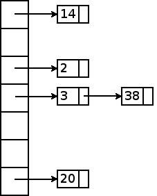
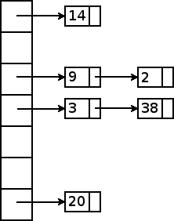

Hash Tables
===========

Copyright (C) 2005-2008, [David H. Hovemeyer](http://faculty.ycp.edu/%7Edhovemey/)

 This work is licensed under a [Creative Commons Attribution-Noncommercial-Share Alike 3.0 United States License](http://creativecommons.org/licenses/by-nc-sa/3.0/us/).

*Hash tables* are another way to implement a *dictionary* data structure.  When implemented carefully, hash tables have the following characteristics:

-   O(1) *average case* running time to add an item to the dictionary, remove an item from the dictionary, or find an existing item in the dictionary.

-   O(n) *worst case* running time for add, remove, and find.  This case is very unlikely, but possible.

-   The items in a hash table are not stored in any particular order.

These characteristics are somewhat different than balanced binary search trees, such as AVL, red-black, and AA trees.  Those data structures all had O(log n) *worst case* running time for add, delete, and find.  So, if we are willing to give up having an easy way to enumerate the items in the dictionary in sorted order (as we could do with an in-order traversal in a binary search tree), and if we can live with O(n) worst-case performance for the dictionary operations, then hash tables look like a good choice.

In addition to better average-case performance, hash tables also tend to be significantly easier to implement than balanced binary search trees.  The balancing operations (rotations and recoloring) required for balanced BSTs can be very complex; the code for a full-featured red-black tree implementation could easily be more than 1000 lines long.  In contrast, a very full-featured hash table data structure can be implemented in 100-200 lines of code.

Idealized Hash Table
--------------------

Before getting into the details of real hash tables, let's first consider an idealized hash table that has *guaranteed worst case* running time of O(1) for insert, delete, and find.

All hash tables are based on an *object equality predicate*.  Objects are considered to be equal if they have the same *contents*.  For example, String objects are equal if they contain the same sequence of characters.  We can define an equality predicate for any other kind of object by considering the sequence of primitive values (chars, ints, etc.) contained in the object.  Two objects having the same containing the same sequence of primitive values are considered equal.

From the sequence of primitive values *s1, s2, s3, ..., sn*, we will compute a *signature*.  The signature is simply an integer that encodes the sequence.  We will compute the signature *N* using the formula

> *N* = *Cn-1 ⋅ s1 + Cn-2 ⋅ s2 + Cn-3 ⋅ s3 + ... + C1 ⋅ sn-1 + C0 ⋅ sn*

In essence, the string *s1 s2 ... sn* is an *n* digit number written in base *C*, and *N* is the integer value of this number.  As long as *C* is greater than or equal to the number of distinct primitive values, then we are guaranteed to get a different signature for every possible object.  As long as we have a fixed upper bound on the maximum sequence length (*n*), we can treat the computation of the signature as a constant-time operation.

Now we can define our ideal O(1) worst case dictionary.  We first allocate an array of infinite length.  On any operation, we first compute the signature *N* of the key involved in the operation.  The operations are then implemented as follows:

> **insert**  
>     if (array[N] != null) return false;else { array[N] = item; return true; }
>
> **remove**  
>     if (array[N] == null) return false;else { array[N] = null; return true; }
>
> **find**  
>     return array[N];
>
Of course, this idealized hash table cannot be implemented in practice. It is not possible to create an infinite array, and the maximum value of a Java int (the type of array index values) is 231-1.

Practical Hash Tables
---------------------

Fortunately, the same basic approach can be made to work well using finite arrays.  We will use the same idea of computing a "signature" of an object: this is the object's *hash code*.  We will compute the hash code using finite arithmetic, and as a consequence, it will be possible for two objects with different contents to have the same hash code.  This is a *hash collision*.  Even though hash collisions can occur, we can still design a practical hash table that has O(1) performance for insert, remove, and find in the *average* case.

Designing a Hash Function
-------------------------

A *hash function* is a method that inspects the contents of an object and returns an integer value such that

1.  Objects with identical contents will return the same hash code
2.  Objects with different contents will, *with high probability*, return different hash codes

Another way to state this principles is that an ideal hash function is a deterministic function whose value, for random input, is uniformly distributed over the range of (finite) integers.

One hard and fast rule of designing a hash function is that every bit of the contents of the object must influence the hash code. If some contents are ignored, it increases the probability that objects with different contents will yield the same hash code.

### A Bad Hash Function

One approach to designing a hash function is to add the primitive values forming the object contents.  For example, an additive hash function for String objects might be written as


int hashString(String s) {
    int hash = 0;
    for (int i = 0; i < s.length(); i++) {
        hash += s.charAt(i);
    }
    return hash;
}


The problem with additive hash codes is that they do a poor job of preventing collisions: in particular, in an additive hash code the *order* of the primitive values is not significant.  For this reason, the following collisions occur:


hashString("ab") == hashString("ba")
hashString("dad") == hashString("add")


Another problem is that there are generally many pairs of integers summing to the same value: so we also would have collisions like


hashString("ad") == hashString("bc")


### A Better Hash Function

A better approach is to return to the original idea of viewing the contents of the object as a string of "digits":

> *N* = *Cn-1 ⋅ s1 + Cn-2 ⋅ s2 + Cn-3 ⋅ s3 + ... + C1 ⋅ sn-1 + C0 ⋅ sn*

Because we are using finite integer arithmetic, we aren't guaranteed to get a unique hash code for every distinct object, but that's OK as long as the distribution of hash codes is reasonably uniform.

It would seem that this approach will be somewhat expensive to compute, because of the need to raise the constant *C* to various powers.  However, that is not necessary because we can rewrite the formula for any number of "digits" as follows:

> *C3 ⋅ s0 + C2 ⋅ s1 + C1 ⋅ s2 + C0 ⋅ s3 = C ⋅ (C ⋅ (C ⋅ (s0) + s1) + s2) + s3*

So, we need one addition and one multiplication per "digit".  So, a better hash function for Strings would be


int hashString(String s) {
    int hash = 0;
    for (int i = 0; i < s.length(); i++) {
        hash *= C;
        hash += s.charAt(i);
    }
    return s;
}


### Choosing C

The only remaining issue is to choose a constant *C* to serve as a "base".  One possibility for a String hash function would be to use C=216, since that is the number of distinct character values in Java.  This value does have the desirable property of guaranteeing unique hash values for Strings of length 2 and smaller.  However, it has one extremely bad property.  Since arithmetic using Java ints is essentially performed mod 232,

> *C*2 = 232 = 0 mod 232

Since *C*2 is a factor of every greater power of *C*, the contribution of every character except the last two in the String is exactly 0.  This certainly violates the principle that every bit of the contents should influence the hash code.  In general, we want *C* to be *relatively prime* with 232, meaning that there are no common factors.  Using any odd value for *C* satisfies this requirement, but a much better idea is to require that *C* is prime.

So, what prime number should we use for *C*?  In many respects, it doesn't matter a great deal.  Smaller values of *C* will increase the probability of collisions among short Strings.  However, smaller values also have the desirable property that the sequence

> *C*1 mod 232, *C*2 mod 232, *C*3 mod 232, *C*4 mod 232, *C*5 mod 232, ...

has a relatively long period of repetition, which is good for uniformly distributing the hash values of longer Strings.

Some common values for *C* include 29, 31, 37, 101, 1009, etc.  The [Prime Number Pages](http://primes.utm.edu/) at U. Tennessee Martin are a good source for small prime numbers.

Mapping a Hash Code to a Hash Bucket
------------------------------------

When searching/inserting/removing an element from a hash table, the object's hash code is first mapped to a *hash bucket*, which is simply an index into the array used to represent the hash table.  The hash bucket index is found by taking the hash code modulo the number of buckets in the hash table.

Because Java ints are signed, and array indexes must be non-negative, we need to handle the case where a hash code is negative.  An easy way to do this is to compute the modulus from the hash code, and then if the modulus is negative, add the hash table size.  This is guaranteed to produce an index in the range 0..*n-1*, where *n* is the number of buckets in the hash table.  For example:


public int findBucket(String s, int tableSize) {
    int bucket = hashString(s) % tableSize;
    if (bucket < 0)
        bucket += tableSize;
    return bucket;
}


Chained Hashing
===============

We still haven't talked about what happens when two objects map to the same hash bucket.  Obviously, with a plain Java array, we cannot store two objects in the same location in the array.  When two items map to the same hash bucket, the result is a *collision*.

The simplest way to handle collisions, and in many respects best way, is using *chained hashing*.  In chained hashing, we use *hash node* objects to store a linked list of items in each hash bucket.  For example, say we have the following hash table:

> 

Each hash node is shown with a number indicating the hash code of the object stored in that node.  Because the hash table has seven buckets, the hash code mod 7 indicates which bucket an item is stored in.  For example, the objects with hash codes 3 and 38 both map to the same bucket (3).  However, because each bucket is a linked list, it can store any number of items.

Let's say that we want to insert a new item with hash code 9.  Taken mod 7, that maps to hash bucket 2.  Although that hash bucket already contains one object (one having hash code 2), it does not matter where in the linked list we store the newly inserted item: the items in a hash bucket have no particular order.  So, the easiest approach is to insert the new item at the beginning of the chain:

> 
