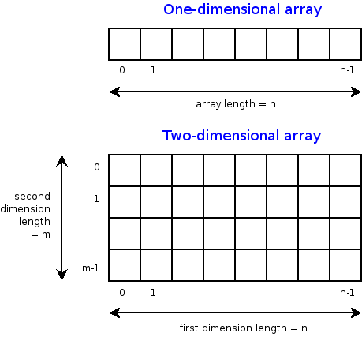
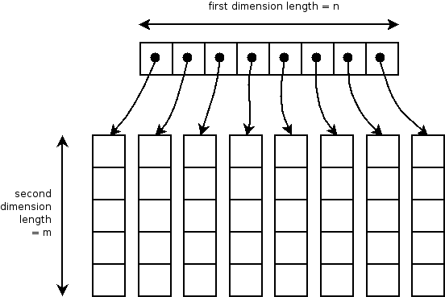
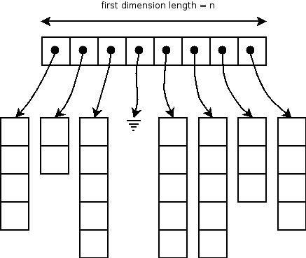

Arrays in Java
==============

Copyright (C) 2005-2008, [David H. Hovemeyer](http://faculty.ycp.edu/%7Edhovemey/)

 This work is licensed under a [Creative Commons Attribution-Noncommercial-Share Alike 3.0 United States License](http://creativecommons.org/licenses/by-nc-sa/3.0/us/).

Array basics
------------

An array is the right data structure to use for the following kinds of problems:

1.  You have a collection of vaues, all of which have the same type or a *compatible* type

2.  The values in the collection can be indexed by integers 0..*n-1* in one or more dimensions

The types of elements in an array are *compatible* if they have a common supertype.  For example, if the classes **Dog** and **Cat** are both subclasses of **Animal**, then an array whose element type is **Animal** can store both **Dog** and **Cat** objects.

Here is how one and two dimensional arrays are organized conceptually:

> 

A two-dimensional array is like a grid.  (You can think of a three dimensional array as being like a cube.)

Arrays in Java
--------------

To declare a variable or field to point to an array, the type of the variable should be declared as having an array type.  An array type is specified by first specifying the *element type* and then adding a pair of brackets ("[]") for each dimension of the array.  Some examples of declaring one dimensional arrays:

>     int[] arrayOfInt;
>     String[] arrayOfString;

Examples of two-dimensional arrays:

>     int[][] gridOfInt;
>     String[][] gridOfString;

Simply declaring a variable to hold a *reference* to an array does not actually create the array itself.  Array types in Java are *reference types*, just like object types.  So, to create an actual *instance* of an array, we need to use a **new** expression:

>     // Creating 1-d arrays of length 10
>     arrayOfInt = new int[10];
>     arrayOfString = new String[10];
>
>     // Creating 30 x 20 2-d arrays
>     gridOfInt = new int[30][20];
>     gridOfString = new String[30][20];

Once an array object has been created, its size remains fixed.  Any time that an array is too small to hold a new data element, the only solution is to allocate a new, larger array, and copy the elements from the old array to the new array.  (We'll see in a moment that this is easy to do.)

One dimensional arrays in Java
------------------------------

One-dimensional arrays are simple to work with.  To refer to an element within a one-dimensional array, just specify the name of an array variable and next specify the index of the element you want to access in square brackets.  Here is an example method which computes the sum of all of the elements of an array of ints:

>     public static int computeSum(int[] arrayOfInt) {
>         int sum = 0;
>
>         for (int i = 0; i < arrayOfInt.length; i++) {
>             sum += arrayOfInt[i];
>         }
>
>         return sum;
>     }

Note that the loop terminates when **i** is equal to the length of the array.  That is because the valid elements of a one-dimensional array are 0 through *n*-1, where *n* is the length of the array.

Multidimensional arrays in Java
-------------------------------

Multidimensional arrays in Java are somewhat more complicated than one dimensional arrays.  This is because multidimensional arrays are actually implemented as a collection of one-dimensional arrays.

For example, here is what a two-dimensional array really looks like in memory:

> 

The first dimension of the array is actually a one dimensional array, each element of which is a lower-dimensional array.  In this case, the first dimension of the array is an array whose elements point to the columns of the overall 2-d array.

Let's say you have a 2-d array of int called **grid**.  Normally, you can ignore the fact that multidimensional arrays have sub-arrays, and just refer to array elements directly:

>     public static int computeSum(int[][] grid, int numColumns, int numRows) {
>         int sum = 0;
>         for (int i = 0; i < numColumns; i++) {
>             for (int j = 0; j < numRows; j++) {
>                 sum += grid[i][j];
>             }
>         }
>     }

However, you can also refer to the sub-arrays of a multidimensional array individually.  You can get the reference to the *i*'th column of the grid by providing a *single* array subscript:

>     // 8 x 5 grid of ints
>     int[][] grid = new int[8][5];
>
>     for (int i = 0; i < grid.length; i++) {
>         int[] column = grid[i];
>     }

Note that the column is a 1-d array of int.

Ragged arrays
-------------

In principle, it is possible for a multidimensional array to be "ragged", meaning that the sub-arrays are not all of the same length, or that some of the sub-arrays are missing (null).  For example:

> 

In general, you will not need to worry about ragged arrays, but you should be aware that they are possible.  Here is how a method to sum the elements of a two-dimensional array could be programmed defensively to handle ragged arrays:

>     public static int computeSum(int[][] grid) {
>         int sum = 0;
>
>         for (int i = 0; i < grid.length; i++) {
>             int[] column = grid[i];
>
>             if (column == null) {
>                 continue;
>             }
>
>             for (int j = 0; j < column.length; j++) {
>                 sum += column[j];
>             }
>        }
>
>        return sum;
>     }

Note that this method does not make any assumptions about the number of rows and columns, and correctly handles the case where a column is missing.

Growing an array
----------------

Once an array is created, its size is fixed.  Therefore, if a situation arises where we need to store an element in an array, but the array is too small, we need to *grow* the array.  We can't do this by changing the size of the original array object.  So, we must allocated a new, larger array, copy the old elements into it, and then add the new element.

Say we want to define a class to store a large number of double values, each of which is indexed by an integer starting at 0.  Any element in the collection that has not explicitly been assigned a value is assumed to have the value 0.0 (which is the default value of doubles in Java.)  Here is how we might define the class:

>     public class InfiniteVector {
>         private double[] storage;
>
>         public InfiniteVector() {
>             storage = new double[1];
>         }
>
>         public double get(int index) {
>             if (index >= storage.length) {
>                 return 0.0;
>             } else {
>                 return storage[index];
>             }
>         }
>
>         public void put(int index, double value) {
>             if (index >= storage.length) {
>                 grow(index);
>             }
>
>             storage[index] = value;
>         }
>
>         private void grow(int index) {
>             allocate a new larger array and copy the old values
>         }
>     }

The question is how to define the **grow** method, which is responsible for allocating a larger array, copying the original elements from the old array to the new array, and then making the **storage** field point to the new array.  Here is one possible approach:

>     private void grow(int index) {
>         double[] bigger = new double[index + 1];
>         for (int i = 0; i < storage.length; i++) {
>             bigger[i] = storage[i];
>         }
>
>         storage = bigger;
>     }

In this approach, we allocate a new array that is just large enough to store the element with the given index.  Here is another approach, where we allocate a new array that is sometimes larger than necessary:

>     private void grow(int index) {
>         int newSize = Math.max(index + 1, storage.length * 2);
>         double[] bigger = new double[newSize];
>
>         for (int i = 0; i < storage.length; i++) {
>             bigger[i] = storage[i];
>         }
>
>         storage = bigger;
>     }

In the second version, the array is grown by at least a factor of 2 each time it needs to be re-allocated.

Why doubling the size is better than growing by 1
-------------------------------------------------

So, which approach should we prefer?  Consider the case where elements are put into the **InfiniteVector** one at a time, starting at index 0, and continuing to some large number *N*:

>     InfiniteVector vec = new InfiniteVector();
>     for (int i = 0; i <= N; i++) {
>         vec.put(i, someValue);
>     }

Consider the amount of copying that must be done as the storage array is re-allocated.  For the "index + 1" approach, each call to **put** from index 1 onward results in the entire storage array being re-allocated and copied.  As a function of the loop iteration, the copying costs look like this:

>     i=0 0
>     i=1 1
>     i=2 2
>     i=3 3
>     i=4 4
>     i=5 5
>     i=6 6
>     i=7 7
>     i=8 8
>     ...

As a finite series:

> 1 + 2 + 3 + ... + *N*-2 + *N*-1

The sum of this series can be found by adding the first and last elements (1+(*N-1*) = *N*), the second and next-to-last elements (2+(*N-2*) = *N*), and so forth.  There are *N*/2 such pairs, each of which totals *N*.  So the sum of the sequence is

> *N*2 / 2

Now consider the "at least double the size" approach.  Each time the array grows, it grows to double its original size.  As a function of the loop iteration, the copying costs look like this:

>     i=0 0
>     i=1 1 (array grows to size 2)
>     i=2 2 (array grows to size 4)
>     i=3 0 
>     i=4 4 (array grows to size 8)
>     i=5 0
>     i=6 0
>     i=7 0
>     i=8 8 (array grows to size 16)

As a finite series, this looks like:

> 1 + 2 + 4 + ... + *N*

An interesting property of this series is that each element is greater than the sum of all previous elements:

>     1 < 2
>     1 + 2 < 4
>     1 + 2 + 4 < 8

Therefore, when we reach loop iteration *N*, where we may need to copy *N* elements, the total amount of copying we have already done is less than *N*.  So, the total amount of copying is about 2*N*.

*Algorithm analysis* is the general term for reasoning about how long an algorithm (such as growing an array) will take to execute given the input size (*N*).  In this particular case, 2*N* is a much better result than *N2 / 2*: it ensures that over time the amount of copying we will have to do is directly proportional to the number of elements we are storing, rather than the square of the number of elements.
