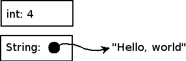
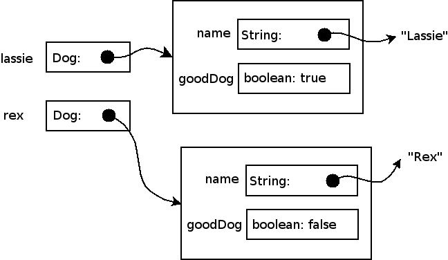
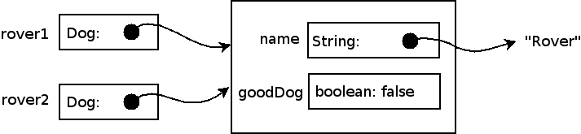
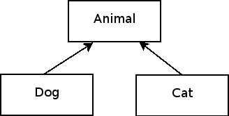

Copyright (C) 2005-2008, [David H. Hovemeyer](http://faculty.ycp.edu/%7Edhovemey/)

This work is licensed under a [Creative Commons Attribution-Noncommercial-Share Alike 3.0 United States License](http://creativecommons.org/licenses/by-nc-sa/3.0/us/).

Memory cells
------------

Objects and arrays are *aggregates*, meaning that they are composed of one or more *scalar* values bound together in a unit.  In order to understand aggregates, it is important to understand what their fundamental building blocks are.  One way to think about aggregates is that they are bundles of *memory cells*.

You can think of a memory cell as a box that can hold a *scalar value* of a particular type.  The type of the value stored in the box can be a *primitive type*, such as int, char, float, double, and the other primitive types we reviewed in the last lecture, or it can be a *reference* to an object or array.  Here are two examples: a memory cell holding the int value 4 and a memory cell holding a reference to the String "Hello, world":

> 

Memory cells are generally *mutable*, meaning that you can store a new value in the box as long as the new value has a type that is compatible with the type of the memory cell.  For example, you can store the value 42 in a memory cell specified to hold values of type int.  However, you cannot store a reference to a java.lang.String object in a memory cell declared to hold int values.

Each memory cell is distinct: storing a value in one memory cell will not change the value of any other memory cell.

You can always read the current value from any memory cell, and you are guaranteed to get a value compatible with the type of the memory cell.  For example, if you read the value of an int memory cell, you are guaranteed to get an integer (and not a java.lang.String reference, a double, etc.).

A *local variable* in a method is a memory cell.  The *fields* of an object are also memory cells, as are the *elements* of an *array*.

Objects and classes
-------------------

An object is a bundle of *fields* (memory cells) and *methods*.  Every object is an instance of a *class*, which defines the object's fields and methods.  Just like local variables, each field of a class, and thus the objects that are instances of that class, has a name.

From a design standpoint, an object represents some *entity* in the *problem domain*.  For example, let's say the problem domain is a children's game where some of the characters are dogs.  You could write a class called "Dog", where instances of this class would represent particular dogs in the game.


/**
 * A simple Java class representing a Dog.
 */
public class Dog {
    private String name;
    private boolean goodDog;

    public Dog(String name, boolean goodDog) {
        this.name = name;
        this.goodDog = goodDog;
    }

    public void bark() {
        System.out.println(name + " barks");
    }

    public void respondToCall(String nameCalled) {
        // Good dogs come when their name is called
        if (name.equals(nameCalled) && goodDog) {
            System.out.println(name + " comes");
        } else {
            System.out.println(name + " does not respond");
        }
    }

    public boolean isGoodDog() {
        return goodDog;
    }

    public void train() {
        goodDog = true;
    }
}


Fields and Constructors
-----------------------

The fields of an object store the *state* of the object.  In the example, the two fields in the Dog class represent the dog's name, and whether or not the dog is a good dog.

A class generally defines one or more *constructors* which define how new instances of the class are created.  A constructor generally assigns each field of the new object an initial value, often by assigning the value of one of the constructor's parameters to the field.  Note that if a parameter has the same name as a field, then you must write "this.*fieldname*" to refer to the field---otherwise, the parameter takes precedence.

In the example above, we've defined a single constructor that takes two parameters (a String and a boolean) and uses them to initialize the two fields of the object.

As an example, we can create two Dog objects:


Dog lassie = new Dog("Lassie", true);
Dog rex = new Dog("Rex", false);


Recall that each field of an object is a memory cell, and so are local variables.  Here is what memory will look like once the objects have been created:

> 

References
----------

A *reference* is an arrow pointing to a particular object or array:

> 

In Java, the only way to access an object or array is through a reference.  When you declare a local variable or field which has a class or array type, what you are really doing is defining a memory cell that can hold a *reference* to that kind of class or array.

The important thing to understand about references is that copying a reference does **not** copy the object.  For example:


Dog rover1, rover2;
rover1 = new Dog("Rover", false);
rover2 = rover1; // Only the reference is copied, not the object!


After this code is executed, both references point to the same object:

> 

We can see this clearly by modifying the object through one reference, and observing the change is reflected in the other reference.


rover1.respondToCall("Rover"); // "Rover does not respond"
rover2.respondToCall("Rover"); // "Rover does not respond"
// rover1 and rover2 both point to the same object, so any
// changes we make to the object are reflected by both references
rover1.train();
rover1.respondToCall("Rover"); // "Rover comes"
rover2.respondToCall("Rover"); // "Rover comes"


The equality and inequality operators ("==" and "!=") are defined for references.  These will tell you whether or not two references point to the same object.  However, they will **not** tell you anything about the contents of the objects (or arrays) themselves!  This can be seen from the following code:


Dog spot = new Dog("Spot", true);
Dog anotherSpot = new Dog("Spot", true);
if (spot == anotherSpot) {
    System.out.println("same");
} else {
    System.out.println("different");
}


The code above prints "different", because "spot" and "anotherSpot" are two different objects, even though the contents of those objects are exactly the same.

To compare the contents of two objects to see if they are the same, you should use the equals method, as seen in the definition of the "respondToCall" method.  Using "==" or "!=" to compare objects instead of the equals method is a very common bug in Java programs, even for experienced programmers.

Null
----

The special reference *null* represents the absence of any object or array.  Basically, it means "points to nothing".  If you try to use a null value---for example, by invoking a method on it---a NullPointerException will be thrown.  In general, this only happens if you have a bug in your program.

Null references are generally drawn like this:

> 

Recursive data types
--------------------

The fields of a class can have *any* valid type.  This means that an object may have one or more fields that have the *same* type as the object itself!  Classes that define fields of the same type as the class itself are *recursive* data types.  Many important data structures, such as linked lists and trees, are recursive data types.

Methods
-------

The *instance methods* of a class perform operations on instances of the class.  In our Dog class, we defined four instance methods: "bark", "respondToCall", "isGoodDog", and "train".  In an instance method, the value "this" is a reference pointing to the object on which the method was invoked.  You can use "this" to explicitly refer to fields and instance methods of the object.  However, in most cases, you can omit "this", because by default, if you refer to a field or instance method, it is assumed that you mean the one belonging to the "this" object.

*Static methods* are methods which are **not** invoked on a particular object.  Therefore, you cannot refer to "this" in a static method.  Static methods are sometimes useful, but in order to appreciate the benefits of working in an object-oriented language, we will generally avoid using them.

The dot operator
----------------

To access a field or method of an object through a reference to that object, you use the *dot operator*:


Dog fifi = new Dog("Fifi", true);

fifi.bark();
// Prints "Fifi barks"

if (fifi.isGoodDog()) {
    System.out.println("Fifi is a good dog");
}


Arrays
------

Objects are useful when you have a fixed number of data values.  However, in some cases, you will need to store an arbitrary number of data values: for this purpose, you can use an *array*.  An array stores a fixed number of values, all of the same type.  For example, this code creates an array of 10 int values, and initializes them with the values 0 through 9:


int[] arrayOfInts = new int[10];
for (int i = 0; i < arrayOfInts.length; i++) {
    arrayOfInts[i] = i;
}


As seen in the example above, arrays have a "length" field indicating how many elements the array contains.

To assign or refer to a particular *element* of an array, use the subscript operator:


System.out.println("Element 6 contains " + arrayOfInts[6]);


The value you use as the subscript must be an integer within the range 0 to *array*.length - 1.  If you pass a negative subscript, or a subscript that is greater than or equal to the length of the array, an ArrayIndexOutOfBoundsException will be thrown.

Like ordinary objects, arrays are accessed through references.

Classes, Intefaces, and Inheritance
===================================

Is-A relationships
------------------

*Inheritance* is a mechanism for expressing "Is-A" relationships in an Object-Oriented programming language.  Here is an example of two "Is-A" relationships:

> A Dog Is An Animal
>
> A Cat Is An Animal

The idea here is that both "Dog" and "Cat" have some common characteristics which are subsumed under the general notion of "Animal".  We can represent this pictorially in an *inheritance diagram*:

> 

In Java terms, we would say that Animal, Dog, and Cat are all *classes*, and that Animal is the *base class*, *superclass*, or *parent class*.  (All of these terms are equivalent.)  Dog and Cat are *derived classes*, *subclasses*, or *child classes*.  (Again, these are equivalent terms.)

Generally, a superclass will define methods which subclasses *override*.  Overriding a method means that a subclass has defined its own implementation of the method.  This is one of the main ideas behind Object-Oriented programming.  The base class specifies what operations instances of subclasses can perform, and the subclasses themselves define how those operations are carried out.

Inheritance in Java
-------------------

Here are some concrete examples of Java classes that use inheritance.  First's, let's define the base class Animal.  We will make this an *abstract class*, which means that it is not possible to create an instance of the Animal class using the **new** operator.  (This is often the case with base classes: we are just trying to develop the notion of some general *category* of classes, but we will leave the concrete implementation details to the subclasses themselves.)  Here is how we might define the Animal class:


public abstract class Animal {
    public abstract void vocalize();
}


The **vocalize** method will be defined by subclasses to make whatever kind of sound is appropriate for the kind of animal the subclass represents.

Now we can define the subclasses Cat and Dog.  We will make these classes *concrete*, meaning that it will be possible to create objects which are instances of Dog and Cat.


public class Dog extends Animal { public void vocalize() { System.out.println("woof"); }}public class Cat extends Animal { public void vocalize() { System.out.println("meow"); }}


For a class to be concrete, it must override all abstract methods defined in any of its superclasses.

Now we can write code that uses the Dog and Cat classes.


Animal lassie = new Dog();
Animal felix = new Cat();

lassie.vocalize(); // Prints "woof"
felix.vocalize(); // Prints "meow"


Note that something interesting is happening: we are creating instances of classes called Dog and Cat, but we are assigning references to those objects to variables whose type is Animal.  This works because Dog is an Animal, and Cat is an Animal.  This illustrates one of the general principles of Object-Oriented programming:

> *An instance of a subclass may be used anywhere an instance of the superclass is allowed*

This is known as the [Liskov substitution principle](http://en.wikipedia.org/wiki/Liskov_substitution_principle).  This principle means that you can, for example:

1.  Pass a Dog object to a method which takes an Animal as a parameter
2.  Return a Dog object from a method which returns an Animal
3.  Assign a Dog to a reference of type Animal

Note that the converse is **not** true: instances of a superclass may not be substituted for instances of a subclass.  For example, the following code is illegal:


public void someMethod(Animal animal) {
    Dog dog = animal; // not allowed!
}


Fields and methods in the superclass are inherited by subclasses
----------------------------------------------------------------

A base class can define its own fields and methods.  These fields and methods are *inherited* by subclasses.  That's why it's called inheritance!  Let's say we want to change our Animal class to represent the idea that all animals have a name:


public abstract class Animal {
    private String name;

    public Animal(String name) {
        this.name = name;
    }

    public String getName() {
        return name;
    }

    public abstract void vocalize();
}


Now that our base class has an explicit constructor, we need to change the subclasses Dog and Cat so that they call it in their own constructors:


public class Dog extends Animal {
    public Dog(String name) {
        super(name);
    }

    public void vocalize() {
        System.out.println("woof");
    }
}

public class Cat extends Animal {
    public class Cat(String name) {
        super(name);
    }

    public void vocalize() {
        System.out.println("meow");
    }
}


The syntax **super(*args...*)** allows the constructors in subclasses to invoke a constructor for their immediate superclass.

Because the subclasses *inherit* methods from the superclass, you can call superclass methods on an instance of a subclass.  For example:


Dog lassie = new Dog("Lassie");
System.out.println(lassie.getName() + " makes a sound: " + lassie.vocalize());
// Prints "Lassie makes a sound: woof"


Even though the **getName** method is defined in the base Animal class, it may be called on subclasses such as Dog.

Packages and imports
--------------------

In Java, a *package* is a namespace for a collection of related classes.  The main purpose of packages is to allow Java classes written by many different people and organizations to be used together in the same program.  Each Java class belongs to a particular package, and the *fully qualified* name of a Java class includes the package name.

Examples:

-   The fully qualified name of the String class in the java.lang package is java.lang.String
-   The fully qualified name of the Animal class in the edu.ycp.cs201 package is edu.ycp.cs201.Animal

Java package names consist of a series of words (usually lower case) separated by dots (the "." character).  The preferred way to name a package is to reverse the components of an internet domain name---for example, "ycp.edu" (York College of Pennsylvania) would become "edu.ycp"---and then add additional words to describe the purpose of the package.

To define the package that a Java class is in, the first declaration in the source file defining the class should be:


package name;


where *name* is the name of the package.

So, why are packages useful?  Imagine that we want to use some Java classes produced by the XYZ company in a program.  For example, their classes might be in the package **com.xyz.zoo**, and one of the classes in that package might be called "Animal".  We can use this class in the same program as another class called "Animal" in the "edu.ycp.cs201" package, because the fully qualified names of the two classes are different.

When you are implementing a class in Java, you can refer to other classes in the same package without doing anything special.  However, if you want to refer to a class in a different package, then you have several options.  Let's say you want to use the class **Animal** from the **com.xyz.zoo** package.  You could specify the fully qualified name of the class wherever you need to refer to it:


package edu.ycp.cs201;

public class Example {
    public static void main(String[] args) {
        com.xyz.zoo.Animal animal = new com.xyz.zoo.Animal();
    }
}


As you can imagine, this approach is tedious.

An easier solution is to *import* the class you need:


package edu.ycp.cs201;

import com.xyz.zoo.Animal;

public class Example {
    public static void main(String[] args) {
        Animal animal = new Animal();
    }
}


You can also import all of the classes in another package:


package edu.ycp.cs201;

import com.xyz.zoo.*;

public class Example {
    public static void main(String[] args) {
        Animal animal = new Animal();
    }
}


There is one exception to the rule about referring to classes in another package: classes in the **java.lang** package are always visible.  You do not need to import them.  For example, when you declare a variable of type **String**, that really means **java.lang.String**.
