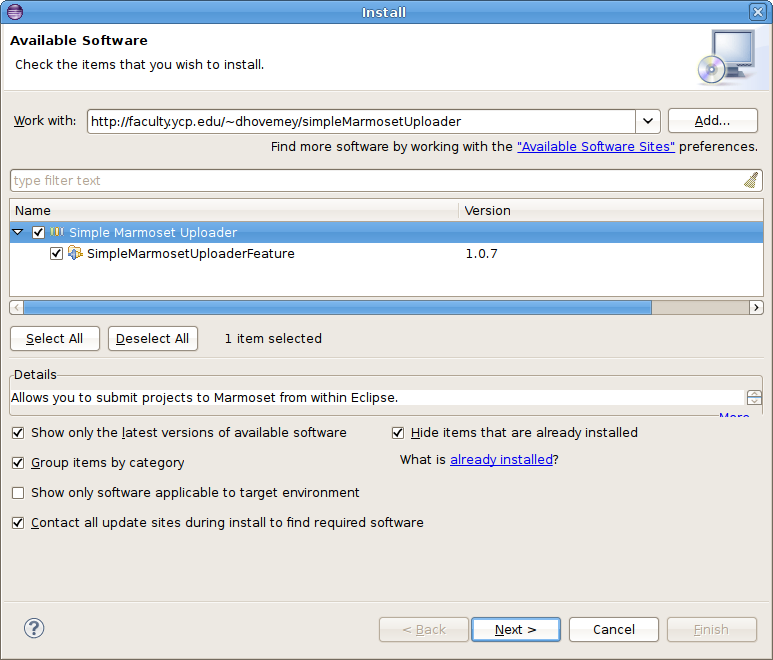
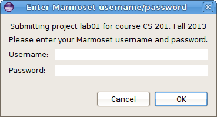
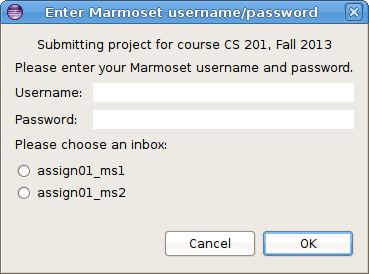

This page has links to useful resources for the course.

Java and Eclipse
================

All of the software we are using is open source (free). I encourage you to download it to install on your own computer.

-   [Java Development Kit](http://www.oracle.com/technetwork/java/javase/downloads/index.html) -This is required to run Java programs. Make sure you download the JDK, not the JRE.
-   [Eclipse IDE](http://www.eclipse.org/downloads/) - This is the Java development environment we are using in class. It has a number of variants. You should get the **Eclipse IDE for Java Developers**.

SimpleMarmosetUploader plugin
=============================

Once you have Eclipse installed, you can install the SimpleMarmosetUploader plugin to allow you to submit projects directly from Eclipse.

The plugin requires Eclipse 3.4 (ganymede) or later.

Please be aware that the plugin is somewhat experimental. [Let me know](mailto:dhovemey@ycp.edu) if you encounter any problems using it.

Installing the plugin
---------------------

Choose **Help** → **Install New Software...**.

Click the **Add...** button

In the **Location:** field, paste the following URL:

> http://faculty.ycp.edu/~dhovemey/simpleMarmosetUploader

In the **Name:** field, enter **Simple Marmoset Uploader**.

Click **OK**. In the **Install** dialog, click on **SimpleMarmosetUploaderFeature**. Both checkboxes should be checked now.

The dialog should now look like this:

> 

Click **Next** twice. When prompted, accept the license agreement, then click **Finish**.

When you see the warning about software that contains unsigned content, click **OK**.

When prompted, click **Restart Now** to restart Eclipse. The plugin should now be available.

Using the plugin
----------------

When you are ready to submit a project (lab or assignment), there are two ways.

1.  Select the project in the package explorer and then press the blue up arrow button in the toolbar:

    > 

2.  Right click on the project and choose **Submit project...**.

If the project has been enabled for submission within Eclipse, you will see a dialog that looks something like the following:

> 

Note: if the project has multiple milestones, the dialog might look like this:

> 

If there are multiple inboxes, you will need to select one.

Enter your Marmoset username and password and click **OK**. If the submission is successful, you will see a dialog that looks something like this:

> 

**Important**: you should still log into the submission server using a web browser to verify that your files were received successfully.
